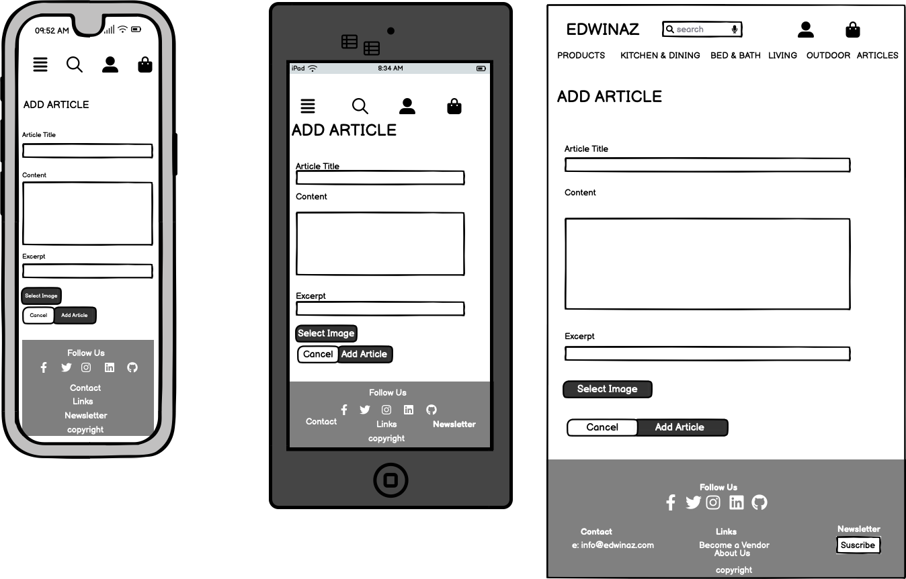
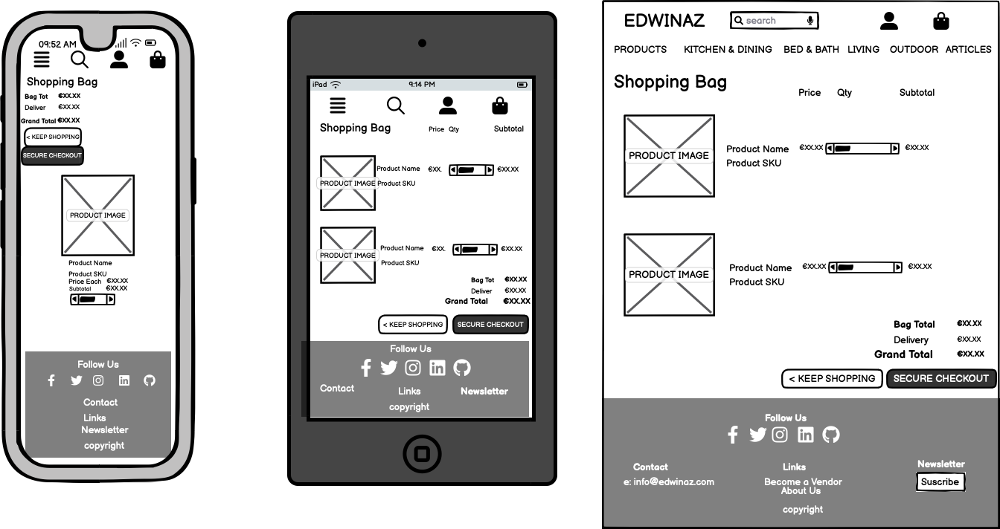

# **Edwinaz**

## **INTRODUCTION** 


Edwinaz is an online multi-vendor ecommerce website for the promotion of homeware goods and was created for educational purposes as part of the Code Institute’s portfolio 5 (e-commerce applications) full stack development course.

Developed using HTML, CSS, JavaScript and Python on a Django framework.

View live project here [Link to deployed site](https://edwinaz.herokuapp.com/)

Stripe test payments card deteils below to check the function of the site.
| Type | Card No | Expiry | CVC | ZIP |
| :--- | :--- |:--- | :--- | :--- |
| Success| Visa | 4242 4242 4242 4242 | A date in the future | Any 3 digits | Any 5 digits |


## **TABLE OF CONTENT** 

  - [UX Design](#ux-design)
    - [Strategy](#strategy)
    - [User stories](#user-stories)
    - [Scope](#scope)
    - [Structure](#structure)
    - [Skeleton](#skeleton)
    - [Design](#design)
    - [Features](#features)
    - [Features left to implement](#features-left-to-implement)
  - [CRUD operations and defensive design](#crud-operations)    
    - [CRUD operations](#crud-operations)
    - [Defensive design](#defensive-design)
  - [Technologies Used](#technologies-used)
    - [Languages](#languages)
    - [Databases platform and cloud storage](#databases-and-cloud-storage)
    - [Libraries and frameworks](#libraries-and-frameworks)
    - [Other technologies](#other-technologies)  
  - [Testing](#testing)
    - [Code validation](#code-validation)
    - [Testing User stories](#testing-user-stories)
    - [Automated testing](#automated-testing)
    - [Code Validation](#code-validation)
    - [Testing performance](#testing-performance)
    - [Issues and known bugs](#issues-and-known-bugs)
  - [Deployment](#deployment)
    - [Deployment](#deployment)
    - [Local Deploy](#local-deploy)
   - [Credits](#credits)
     - [Code](#code)
     - [Media](#media)
     - [Acknowledgment](#acknowledgments)

## **UX DESIGN**

### **Strategy**  

Edwinaz is a fully functional responsive multi-vendor e-commerce platform with the home owner in mind who is interested in home decoration and home improvement as it target audience. The site offers informative articles on home improvements where the visitors can browse through blog like articles developed by the administrator and vendors of the site on home improvement ideas. 
It provides a platform for registered vendors to display their range of products they wish to promote on the platform and also offers them an article post option where the vendor can write informative articles which will act as both an informative source for prospective customers and also an opportunity to gain prominence on search engines by implementing good search engine optimisation.
   
#### **Site Owner's Goals**
  - To carve out a presence in the home improvement online sector.
  - To connect with target audience of home improvement enthusiasts.
  - To offer site users informative articles that are of interest.
  - To provide a platform for vendors to upload their products and articles.

#### **User Goals** 
  - To be presented with an informative and well designed responsive platform to browse home improvement products and articles.
  - To be able to order multiple items from different vendors on one site.
  - To be able to adjust order conveniently during purchase session.
  - To be able to save profile and delivery details.
  - To view orders made previously.

### **E-Commerce Business Model**
Objective of this project is to sell directly to individuals, a Business-to-Customer (B2C) model, where the customer makes a single payment for goods purchased and there are no subscriptions charges or repeating fees. Even though the business sells its products through different vendors directly to the customer, there is no involvement of any third parties in the model.

#### **Marketing Goals**
Marketing of the site would take many different stategeis. The site's target audience are home makers that are interested in current trends in home decoration, homeware, home improvement and bringing these ideas into their own home. With a relatively modest budget for marketing the site owner's strategy is to use social media marketing to promote the site at it's target audience. Social media platforms Facebook, Instagram, Youtube, WhatsApp, Pinterest, TikTok and many others provide a channel to their audience that can be utilised at a free or a relatively competitive charge. A comprehensive marketing strategy would include regular feeds into a selection of these channels. Facebook's presence as a social media platform is a good match for the Edwinaz target audience as it's audience is older and more mature. 
- Showcase the site by publishing informative, engageing content on a regular basis. Use facebook's pages to spread your marketing message to a much larger audience.
- Build brand awareness at every opportunity. Include your logo and site's slogan on all communication. Use eye catching colours and fonts that will be memorable to new customers.
- Generate leads by using call to action landing pages, emails and offers.
- Engage with customers and followers. Respond to enquiries and comments from customers offering them a positive experience every time they engage with your site or social media portal.
- Drive sales through e-mail marketing by bringing special offers to your customer.

Mailchimp Special offer marketing


#### **SEO & Keyword Research**
Keyword research forms the foundation of any successful SEO strategy. Identify relevant keywords and phrases that the site's target audience is likely to use when searching for homeware products. Working with tools such as wordtracker.com, Google Keyword Planner or SEMrush can assist in finding popular keywords but using the free version of these packages will not produce sufficient search results as keywords are limited.
Keywords and phrases after brainstorming, keyword research, using Google auto-fill and related terms resulted in the following:

    <meta name="description" content="Buy homeware, soft furnishings, household gifts, bed linen, home decor, housewarming gifts, furniture and designer makeover products at Edwinaz .Our shop provide quality, refined dining room, living room and bedroom furniture. Edwinaz is a comprehensive lifestyle and homeware online store.">

    <meta name="keywords" content="homeware,house warming presents and gifts,interiors,modern,urban,contemporary,stylish,bohemian,rustic,chic,classic,high end,lifestyle,wedding gift,home,furniture,">


 Keywords are then introduced into website's content, meta tags (as shown above), headings, and product descriptions. This increase the chance of ranking higher in search engine results.

 
Creating high-quality and engaging content is essential not only for attracting search engine attention but also for captivating your website visitors. Articles, and guides that are informative, useful, and relevant to the site's target audience's interests are uploaded by vendors on a regular basis to build  an affinity with the site's audience. Typical ideas include home decor tips, DIY projects, and product reviews. Chosen keywords are incorporated naturally into the content which strives to provide value to readers, encouraging them to spend more time on the website and increasing the likelihood of conversions.


Detailed and optimised product descriptions are crucial for both search engines and potential customers. Each vendor crafts a unique and compelling descriptions for each product, highlighting their features, benefits, and any relevant keywords. Extra fields, categories and style accommodate a structured attachment of certain keywords with products. The use of high-quality images, that showcase products and articles, optimise the image alt tags with relevant keywords improves the accessibility of the website but also enhances chances of appearing in image search results. 
Responsive website design which is optimised for mobile devices increases the number of users browsing and making purchases through their smartphones. Mobile friendly design ensures that the website looks and functions well on any device, improving user satisfaction and search engine rankings. 


Optimise Facebook page by including relevant keywords in the page name, About section, and post descriptions. The use of cover photos and copy that reflects brand's identity is replicated on Facebook page and posts. Regular updates, including product showcases, home decor inspiration, and tips related to your homeware niche are uploaded to Facebook page.


### **Scope**


#### **FEATURES**

#### **Plan**
When considering a project design one needs to look at features that offer opportunity for the project. Weighing each feature with a score of importance level and viability, rated low(1) to high(5), creates a measurable outcome that prioritises funnctions based on importance and viability. Features that score highly on importance and viability will be features that must be addressed first as part of the minimum viable product. Mid range scores are 'should have features', which will be added to the project once the minimum status has been achieved. Low scored features, are 'could have features' and may not be reached in this iteration and will be marked to be addressed into the future.

In this project there are different features of the site available to the type of user. Four natural categories of users can be classified for the site, visitors (who do not have an account), registered users (who have signed up for an account), vendors (signed up users that offer products and write articles for site), and Admins (users who have superuser status with additional privileges).

 User Type | Feature | Important | Viable | Delivered |
  --- | --- | --- | --- | --- 
  Visitor | A/C Sign up | 5 | 5 | Yes |
  User | A/C Sign in | 5 | 5 | Yes |
  User | A/C Sign out | 5 | 5 | Yes |
  User | Social A/C Sign in | 2 | 3| No |
  Vendor | A/C Sign up | 5 | 5 | Yes |
  Vendor | A/C Sign in | 5 | 5 | Yes |
  Vendor | A/C Sign out | 5 | 5 | Yes |
  Vendor | Social A/C Sign in | 2 | 3| No |
  Admin | A/C Sign in | 5 | 5 | Yes |
  Admin | A/C Sign out | 5 | 5 | Yes |
  All | Search products | 5 | 5 | Yes |
  All | View product detail | 5 | 5 | Yes |
  All | View about page | 5 | 5 | Yes |
  All | View policy page | 4 | 3 | No |
  All | View privacy page | 4 | 5 | No |
  All | access social media | 3 | 5 | Yes |
  All | Contact form | 3 | 5 | No |
  All | Newsletter subscribe | 4 | 5 | Yes |
  All | Add wishlist| 2 | 5 | No |
  All | Article comments | 2 | 4 | No |
  All | Add products to bag | 5 | 5 | Yes |
  All | Checkout products | 5 | 5 | Yes |
  Visitor | Checkout without A/C | 3 | 5 | Yes |
  All | Stripe payment | 5 | 5 | Yes |
  All | View Articles | 5 | 5 | Yes |
  All | Search Articles | 3 | 4 | No |
  All | View Article detail | 5 | 5 | Yes |
  All | view cart | 5 | 5 | Yes |
  All | Add delivery detail | 5 | 5 | Yes |
  Visitor | Delivery detail not saved | 5 | 5 | Yes |
  User, Vendor & Admin | View order history | 3 | 5 | Yes |
  All | Order email confirmation | 5 | 5 | Yes |
  Vendor, Admin | View own product list | 5 | 5 | Yes |
  Vendor, Admin | Add product | 5 | 5 | Yes |
  Vendor, Admin | Edit product | 5 | 5 | Yes |
  Vendor, Admin | Delete product | 5 | 5 | Yes |
  Vendor, Admin | Add Article | 5 | 5 | Yes |
  Vendor, Admin | View own Article list | 5 | 5 | Yes |
  Vendor, Admin | Edit Article | 5 | 5 | Yes |
  Vendor, Admin | Delete Article | 5 | 5 | Yes |
  Vendor | View recent orders received| 3 | 4 | No |
  Vendor | Discount coupon | 3 | 4 | No |
  Admin | Order analysis | 3 | 3 | No |

#### **Importance v Viablle Trade-Offs**
Plotting the importance against the viability of each feature the most important features are identified and given the attention to be completed. Due to time limitations all of the desired features will not be met and working towards a minimum viable product the features given a Yes in column 4 will be given priority to be implemented.

#### **Functional requirements**
  - To be able to login and logout
  - To be able to sign-up using email address and secure password
  - To be able to reset password 
  - To be able to view and edit profile information
  - To be able to add/view/edit/delete a product as vendor
  - To be able to add/view/edit/delete an article as vendor
  - To be able to view and edit shopping bag
  - To be able to process orders and add order to profile history
  - To be able to process card payement
  - To be able to sort shop items according to a set of criteria 
  - To be able to email notification to users
  - To be able to notify user on success of failure on actions  
  - To be able to handle errors: page 404 not found, page 500 Internal Server Error and page 403 access denied
        
    
#### **Non functional requirements**
 - Incorporate a narative in articles that will engage visitors to revisit site and view content.
 - Requirements that build confidence with customer, building social media profile, etc.

#### **Becoming a Vendor**
  The process of vendor setup is simplified for the purpose of this project. After registering and logging in the user can request to be a vendor by clicking on 'become vendor' in footer. Although in reality the become vendor process would be a more arduous process the request to become vendor is sanctioned instantly. The privileges of being able to add, edit, list and delete products and posts are conferred to the vendor
  
#### **Vendor and Admin Content generation**
    - Articles to be generated by vendors and admin.
    - Admin are able to add, edit and delete articles and products
    - Image to be included in article along with title, content and excerpt.
    - Vendor are able to add, edit and delete articles and products.
    - Details of product include product image, name, category, style, description and price.
    - The use of forms where user input is required.
    - Text and headings to identify main sections of the site.
    - The use of icons for visual conciseness. 

    
### **Structure**

### **User Stories** 
The project was developed using the Agile Methodology. GitHub issues, projects, and milestones were used to manage user stories. The user stories were defined as issues and are available at: [edwinaz issues](https://github.com/dooco/edwinaz/issues?page=1&q=is%3Aissue+is%3Aopen) 
The project is available at: [edwinaz project](https://github.com/users/dooco/projects/7). The numbering of issues on github does not align with user stories presented here in the documentation. As the project developed issues were added and to group user stories under functional headings the numbering would not follow.

#### **Navigation**
      1. - As a user I want to be able to view the site on desktop, tablet and phone so that I can view the site with ease on each device
      2. - As a user I want to be able to view a catalogue of products so that I can select products to purchase
      3. - As a user I want to be able to click on a product so that I can view more details about this product
      4. - As a user I want to be able to select a category of products so that I can view products I am interested in and avoid searching through all of the products
      5. - As a user I want to be able to view all of the products from a vendor so that I can select the products from the vendor's product list that I like
      6. - As a user I want to be able to view all articles from a listed vendor so that I can view articles of interest from that particular vendor
      7. - As a user I want to be able to search for product in name or description field so that I can find a product I want to buy
       
#### **Registration and account management** 
      8. As a user I want to be able to register for an account so that I can place orders, save my details and view previous orders
      9. As a site user I want to be able to easily login and log out so that I can access my personal information and so that my history and address details are saved
      10. As a site user I want to be able to have a personal user profile so that I can view my personal history and order confirmation, and save my payment information
      11. As a site user I want to be able to receive an email confirmation after registering so that I can verify my account registration was successful
      12. As a site user I want to be able to recover my password should I forget it so that I can recover access to my account

#### **Shopping and Checkout**
      13. As a shopper I want to be able to add products to cart so that I can purchase the items I want
      14. As a shopper I want to be able to select a product and quantity so that I can purchase multiple products
      15. As a shopper I want to be able to view items in my cart so that I can see all my purchases, their subtotal cost and total for cart
      16. As a shopper I want to be able to adjust or remove items in my cart so that I can easily make changes to my purchases before I check out
      17. As a shopper I want to be able to easily enter my card details so that I can check out and complete purchase
      18. As a shopper, I want to receive confirmation for my order so that I can have a proof of purchase
      19. As a shopper I want to be able to feel my personal and payment information is safe and secure so that I can confidently provide needed information to complete purchase
      20. As a shopper I want to be able to view an order confirmation so that I can make sure that I haven't made an error
    

#### **Vendor Functions**
      21. As a user I want to be able to log onto site and request to be register as a vendor so that I can become a vendor and promote my products for sale
      22. As a vendor I want to be able to view my product list so that I can ensure its up to date
      23. As a Vendor I want to be able to add a product so that I can expand my inventory for sale
      24. As a Vendor I want to be able to edit my products so that I can keep my inventory up to date
      25. As a Vendor I want to be able to delete a product so that I can keep my inventory up to date
      26. As a Vendor I want to be able to view my list of articles so that I can keep up to date with my articles
      27. As a Vendor I want to be able to add new articles so that I can add informational posts and promote my products
      28. As a vendor I want to be able to edit my articles so that I can keep my articles up to date
      29. As a vendor I want to be able to delete articles so that I can keep my articles up to date

#### **Newsletter**
      30. As a shopper I want to be able to sign up for a newsletter so that I can be emailed with regular updates from website
      31. As a shopper I want to be able to unregister for receiving newsletters so that I can opt out of receiving any further newsletters should I wish

#### **Admin** 

      32. As an admin I want to be able to add edit and delete articles and products so that I can keep site functional and up to date
      33. As an admin I want to be able to view and manage orders received so that I can ensure that orders are processed in a timely manner
       


#### **Database structure**

  The database structure is shown below:
  .

    
**User**
  - Allauth is used for registration of user upon signing up

**UserProfile model**
  - A one to one relationship is made with Auth User model.
  - Other information such as full name, phone number and address can be updated at checkout or on profile page.
  - is_vendor boolean field is used to identify if the user is a vendor and confer vendor privilages
  - The order models has a foreign key relationship to this model to easily retrieve users' order details.

**Category model**
  - Category model has two fields, name and friendly name.
  - The product models has a foreign key relationship to this model to easily identify categories in products.

**Style model**
  - Style model has one field, name field, which holds the style type of the product which could be used for filtering.

 **Product model**
  - Product details such as name, description, category, style, sku, price and image have their own fields in this model.
  - User and vendor fields create a foreign key relationship to this models UserProfile and Vendor.
    
**Order model**
  - Customer details such as full name, address, email, phone number are stored as fields in this model.
  - Order number, automatically generated, grand total, delivery cost and order total are stored in fields also. 
  - Original bag and strip pid fields are used in verifying payment and order recording.
  - User profile field has a foreign key relationship with UserProfile model.

**OrderLineItem model**
  - Order details that have been added to the user’s shopping bag is stored here.
  - Order field has a foreign key relationship with order model.
  - Product field has a foreign key relationship with product model.
  - The quantity field holds the quantity of product purchased.
  - Line item total records the product of quantity and product price.
    
**Vendor model**
  - The vendor model stores the vendor's name in one field.
  - A one to ine field, created by, points to the user model.
      
**Post model**
  - The post model is used to hold article information posted by vendors.
  - It consists of title, content, excerpt, image and date added fields.
  - A user field has a foreign key relationship with UserProfile model which can be checked if is_vendor true.

### **Skeleton**
    
### **Wireframes**
Home Page

Products page
 
Article page

Article detail page

Add an article page

About Page

Product datail page

Add product page

Bag page

Checkout page

Thank you page

Sign-up page

Log in page

Profile page

404 Error page

Vendor page

Newsletter subscribe page


### **Design** 

  The website will feature a simple, modern design, with minimum colours to keep the emphasis on the products.

#### **Imagery**

  The website features images from vendor's posts and products. Images of products are 450x450 pixels with image filling most of card and a white backgroun. This is to keep site simple and clean. The images used in the article section of vendor post is 800x450 pixels 

#### **Colour scheme**
 
  To generate a simple clean style with good contrast the website uses mostly dark grey, black and white with some additional colours for interactive purposes.
  The website will use the following colour palette, which was custom-made and checked for accessibility using Adobe Color:

         

#### **Typography**
  As the design of the website is to be clean and simple, two fonts were chosen to reflect this. The website uses the Nunito Google font for headings and titles. Font weight of 800 is used predominatly which gives a strong bold look for headings:

   
  
  The Lato font is used for general text in line with the site's overall clear and simple style. Font weight of 400 is used throughout and is distinctive and easy to read.

   


#### **Icons**
Icons by font-awesome are used throughout the website to allow users to quickly access functionalities such as adding items to the shopping cart and also used to in footer to link to social media accounts. They are also associated with representing product and article fields and easily identify date as a calander, vendor as a cart, category as a tag etc. 
Bulma is an icon element container for any type of icon font.To take control over the space the icons will take, the icon class is used as a reliable square container that will prevent the page to "jump" on page load.

#### **Styling**
Horizontal lines are used to structure and make the content of the website easy to read.
Slightly rounded edge borders and buttons are used for a softer and inviting interface.

#### **Features**

Header section to include site name logo text and navigational links with collapsible menu on small screens.


The homepage  will consist of a hero image and links to articles and products. Inspiration for 'cover-text' class, to contrast text on hero image, was taken from Code Institute's 'Love Running' walkthrough.


About page to include information about the company and its vendors.


Products page to include a selection of products. Four random articles are displayed at the top of the products page to attract user to informative articles posted by vendors on the site.
 

Products detail page displays more information about the product.


Article list page to include articles for visitor to browse through.


Article page to display articles published by vendors and provide links to add, edit and delete articles to vendor with privaleges.


Shopping bag page to display items added in the bag, price, delivery cost, total and options to change quantity.


Checkout page follows the bag page when user clicks on 'secure checkout' and is used to gather information on the shopper and delivery details.


Thank you page confirms that the transaction has been processed and prompts use that an email will be sent to confirm order.


Profile page to allow user to update their information and also to view older orders.


Vendor page displays products and articles published by vendors and provide links to add, edit and delete products / articles  belonging to vendor.


Vendor add product page is where logged in vendors add new products to thier store on the site.


Vendor add article page is where logged in vendors add new articles to thier store on the site.


Footer to include links to about, contact, social media, newsletter sign-up and become vendor link. All the social media links and external link to Housewares.org have relevant REL tags that open link in new browser.


404 Error page is called when the page a user is trying to access cannot be found.

  
Admin add a product page is part of product management.
  


#### **Interaction design**

- Collapsible menu.
- Collapsible footer.
- Responsive design with mobile first approach.


### **User Authentication**
- To be able to login and logout securely.
- To be able to sign-up using email address and secure password.
- To be able to reset password 

  ### **Profile management**
- To be able to view and edit profile information.
- To be able to reequest to become a vendor.
- As admin add, delete users.

### **Vendor product & article management**
- To be able to add/view/edit/delete a product as vendor.
- To be able to add/view/edit/delete an article as vendor.
### **Cart and checkout**
- To be able to view and edit shopping bag.
- To be able to process orders and add order to profile history.
- To be able to process card payement.
- To be able to sort shop items according to a set of criteria.
- To be able to receive order confirmation email. 
### **Progress Notification**
- To be able to notify user on success of failure on actions.  
- To be able to handle errors: page 404 not found, page 500 Internal Server Error and page 403 access denied


 
### **Features left to implement**
- To be able to search articles with search terms in title, excerpt and content of article.
- Pagination on shop when displaying all items 
- To allow Vendors the ability to view most recent orders.
- Improved user interface for the vendor to manage articles and products.
- Integration with paypal.
- Allauth integration with social media platform.

## **CRUD operations**

### **CRUD operations**
Operations | all user | auth. user | Vendor/admin |
--- | --- | --- | --- 
View homepage | Yes | Yes | Yes |
View about page | Yes | Yes | Yes |
Add/edit/delete article | No | No | Yes |
Add/edit/delete categories | No | No | Yes |
View shop | Yes | Yes | Yes |
View product details | Yes | Yes | Yes |
Add/edit/delete articles | No | No | Yes |
Add/edit/delete products | No | No | Yes |
View add to bag | Yes | Yes | Yes |
Checkout page | Yes | Yes | Yes |
Login | No | Yes | Yes |
Register | Yes | No | No |
View profile | Yes | Yes | Yes |
Edit profile | No | Yes | Yes |
View order history | No | Yes | Yes |
View order details | No | Yes | Yes |


### **Defensive design**
To prevent users accessing pages where they don't have the relevant permissions a defensive approach to programming has been taken. This has been achieved by checking whether a user is registered user, a vendor for vendor tasks and superuser for admin related tasks. If a user try to access an area that they don't have the required permission, they will be denied access and shown an error toast to let them know they don't have the required permission for that area.
     

#### **Add/edit/delete articless**
- Conditions in place to ensure that only the superuser and vendor can add/edit/delete articles.
- If an article has been posted, it can be seen by all visitors to site.

#### **Add/edit/delete products**
- Admin can add products and assign them to a vendor. 
- Admin can edit and delete any of the products.
- Vendor can add and delete products on their own store.

#### **Checkout page**
- Users can order and not set up an account but will not have their order saved to their profile.

## **Stripe as a Payment Method**

Stripe was selected as payment method for the following consideration:  
- Ease of implementation and customisation 
- Well documented and maintained. 
  
  

## **TECHNOLOGIES USED**

### **Languages**
- [HTML](https://html.spec.whatwg.org/multipage/)
- [CSS](https://www.w3.org/Style/CSS/Overview.en.html)
- [Javascript](https://developer.mozilla.org/en-US/docs/Web/JavaScript)
- [Python](https://www.python.org/)

### **Databases and Cloud storage**
- [SQlite](https://www.sqlite.org/index.html): SQL development database integrated by default as part of Django framework
- [ElephantSQL](https://www.elephantsql.com/): SQL database service provided by Elephant SQL for database management
- [Heroku](https://www.heroku.com/): Deployment application to run production ready dynamic programs
- [Amazon AWS S3](https://aws.amazon.com/s3/): Static files storage bucket for image files in production
- [Stripe]*(https://stripe.com): Payment gateway
  
### Stripe

To process test payments the following test cards can be used:

| Type | Card No | Expiry | CVC | ZIP |
| :--- | :--- |:--- | :--- | :--- |
| Success| Visa | 4242 4242 4242 4242 | A date in the future | Any 3 digits | Any 5 digits |
| Require authorisation | 4000 0027 6000 3184 | A date in the future | Any 3 digits | Any 5 digits |
| Declined | 4000 0000 0000 0002 | A date in the future | Any 3 digits | Any 5 digits |

### **Libraries and Frameworks**
- [Django](https://www.djangoproject.com/): Django 3.2 Long Term Support version, Python web framework for dynamic development of front and backend projects
- [Font Awesome](https://fontawesome.com/): Icon repository used for icons used on the site
- [Google font](https://fonts.google.com/): Font family warehouse for selecting fonts for website design
- [Jquery](https://jquery.com/): A simplified DOM manipulation tool for developong JavaScript code
- [Gunicorn](https://gunicorn.org/): Server to support WSGI HTTP deployment of Django applications
- [Pillow](https://pypi.org/project/Pillow/) Python library for working with images
- [Bootstrap4](https://getbootstrap.com/docs/4.0/getting-started/introduction/): Template for responsive web development
- [Django allauth](https://django-allauth.readthedocs.io/) Authentication, registration, login/log out
- [Django Crispy FormS](https://django-crispy-forms.readthedocs.io/en/latest/): Django forms rendering app
- [Django-countries](https://pypi.org/project/django-countries/): Django pre-built country field app supporting valid country codes
- [Mailchimp-marketing](https://mailchimp.com): Mailchimp newsletter app for integrating newsletter mail on site

   

### **Other technologies**
- [Canva](https://canva.com/): Online graphic design tool for editing images
- [Balsamiq](https://balsamiq.com/): Wireframe design tool for mocking up pages on devices
- [Lucidchart](https://www.lucidchart.com/): Flow chart design tool
- [W3C Markup Validation Service](https://validator.w3.org/): HTML validation
- [W3C CSS Validator](https://jigsaw.w3.org/css-validator/): CSS validation
- [WAVE Web Accessibility Evaluation Tool](https://wave.webaim.org/): Web accessibility
- [PEP8 online](http://pep8online.com/): Python validation
- [JSHint](https://jshint.com/):  jquery/javascript validation
- [Chrome DevTools](https://developer.chrome.com/docs/devtools/): Google development tool to test site responsiveness and errors
- [Page Speed](https://pagespeed.web.dev/): Tool for site  performance assessment
- [Xml Sitmap](https://www.xml-sitemaps.com/) Site map generator
- [Wordtracker](https://www.wordtracker.com/) Keyword research tool


## **TESTING**

### **Introduction**
The website was tested as it was being developed using:
- Chrome developer tools and Firefox developer tools
- Use of console.log() in JS testing to check if code is functioning 
- Viewing terminal for backend functionalities by printing expected outcome
- Manual testing of user stories
- Site navigation and functionality
- A sample of unit tests were conducted 'home' and 'blog' app 

  

### **Manual testing**
### Testing User Stories

| ID | As a | I want to be able to  | So that I can | Achieved by | Evidence |
| :--- | :--- | :--- | :---| :--- | :---: |
| 1 | Shopper | view a catalogue of products | select products to purchase | Home page leads to Product or Article page. The product page provides a sample of articles followed by a full catalogue of products. Users can easily access to their account, shopping bag, search bar and the product categories.   | [Large Screen Navbar](documentation/testing/user-stories/large-screen-nav-bar.png) & [Small Screen Navbar](documentation/testing/user-stories/mobile-nav-bar.png) |
| 2 | Shopper |register for an account  | place orders, save my details and view previous orders | Visitors can register for an account via the account section in the navbar, available on all pages of the site. If visitor doesn't have an account setup before checkout, they are given an option to create an account, or they can just fill in their details and not register. | [Register](documentation/testing/user-stories/register.png) |
| 3 | Shopper | click on a product  | view more details about this product | When shopper clicks on a product, they will be taken to the product detail page which lists more information such as the item name, category, style, vendor name, price and full description. If shopper wishes to view a larger image of product, they can click on the image and a larger version of the image will open in a new browser tab.  | [Product Details](documentation/testing/user-stories/product-detail.png) |
| 4 | Shopper | select a category of products | view products I am interested in and avoid searching through all of the products | When shopper clicks on a category, a dropdown displays a breakdown of items within that category. Shopper has the choice to refine the products search by selecting the sub-categories of the category. | [Category](documentation/testing/user-stories/category-dropdown.png) |
| 5 | Shopper | view all of the products from a vendor | select the products from the vendor's product list that I like | A shopper that purchases or likes a product from a vendor, might like other products from that vendor. By selecting vendor from products dropdown the shopper can view the products from each vendor grouped together. Thus a shopper can make a choice to view that vendor's products without searching the whole product listing. | [View Vendor List](documentation/testing/user-stories/view-vendor-products.png) |
| 6 | Shopper | search for product in name or description field | find a product I want to buy | Shoppers are able to search all products and their descriptions for search terms they are interested in. By typing in search term into the search box and clicking on search icon (or RETURN) a search will be performed resulting in displaying only products with search term in product name or in product description. This will narrow the number of products that the shopper will have to view.| [Search](documentation/testing/user-stories/search-soft.png) |
| 7 | Shopper | add products to cart | purchase the items I want | Shopper can proceed with process of purchasing product by adding it to shopping bag. after selecting product and clicking on 'add to bag' a pop-up confirms success in adding the product to bag. At this point the shopper is given the option to proceed to checkout. | [Add product to cart](documentation/testing/user-stories/add-product-to-bag.png) |
| 8 | Shopper | select a product and quantity | purchase multiple products | Shopper can select to purchase multiples of product selected by clickiing on the '+' or '-' element in the quantity field (or by typing in the required number in quantity field). | [Quantity](documentation/testing/user-stories/quantity.png) |
| 9 | Shopper | view items in my cart | see all my purchases, their subtotal cost and total for cart | By clicking on the bag icon in top nav bar the shopping bag is displayed. Here all the items in the bag are shown, their quantity, line item total, grand total, delivery cost, and a prompt for free delivery if total is not above free delivery threshold. | [Shopping bag](documentation/testing/user-stories/shopping-bag.png) |
| 10 | Shopper | adjust or remove items in my cart | easily make changes to my purchases before I check out | Shopper is able to adjust quantity and delete item in shopping bag before proceeding to checkout. This is to give a better user experience and make the process adaptable to the user's needs. | [Adjust / delete items](documentation/testing/user-stories/adjust-delete-bag.png) |
| 11 | Shopper | easily enter my card details| check out and complete purchase | On the checkout page the shopper can see clearly the information that is need to be completed to complete their order, their details, the delivery information and the card payment information. Payment success will be displayed on completing the checkout. | [Payment details](documentation/testing/user-stories/checkout.png) |
| 12 | Shopper | view all articles from a listed vendor | view articles of interest from that particular vendor | By Clicking on ARTICLES in main nav bar the shopper can select articles to be viewed. At time of writting the option to view specific vendor's article listing was not implemented. | [Article list](documentation/testing/user-stories/articles.png) |
| 13 | Shopper | feel my personal and payment information is safe and secure | confidently provide needed information to complete purchase | Shoppers feel comfortable using trusted payment gateway providers such as stripe. Stripe API is integrated to site so that you are not diverted to a new tab or website which provide for better user experience and confidence. | [Credit card ](documentation/testing/user-stories/credit-card.png) |
| 14 | Shopper | view an order confirmation | make sure that I haven't made an error | Shopper is brought to Thank You page and a confirmation is displayed in right corner. | [Order success](documentation/testing/user-stories/order-success%20.png) |
| 15 | Shopper | receive a confirmation email | have confirmation for my record | Upon successful checkout, the shopper will be sent a confirmation email to the email address provided at checkout to confirm their order details.  | [Checkout email](documentation/testing/user-stories/order-email-confirmation.png) |
| 16 | Shopper |  have a personal user profile | view my personal history and order confirmation, and save my payment information | By clicking on 'My Account' and then 'My Profile' users can enter their name, phone number, email address and full address to the site and have this information stored for future transactions. Also user profile allows user to view previous order history.  | [Personal User Profile](documentation/testing/user-stories/profile.png) |
| 17 | Shopper | search articles| view articles on a particular search term that I am interested in | To avoid viewing the complete article collection to find articles on a particular topic, a search option on an entered search term would search though article title and content fields and return a subset of total articles which have the search term present. | [Not completed](documentation/testing/user-stories/sad-face.jpeg) |
| 18 | Shopper | easily login and log out| access my personal information and so that my history and address details are saved | Shopper can easily log in and log out with full access to order history and shipping details. | [Log in / log out](documentation/testing/user-stories/signin-signout.png) |
| 19 | site user | receive an email to confirm my email for registering | verify my email and register successfully | It is important to verify that the email address is that of the user. By sending an email to the email address provided and requiring a confirmation acknowledgement - a simple check that the user has access to the email is confirmed. | [Register email](documentation/testing/user-stories/confirm-registration.png) |
| 20 | Shopper | recover my password should I forget it | recover access to my account | By clicking on 'forgot password' the user is prompted to enter their email address for a recovery email to be sent to. | [Reset Password](documentation/testing/user-stories/password-reset.png) |
| 21 | Shopper | receive an email to reset my password  |  securely reset my password |  User is sent an email to the email address provided (if it is a registered email) and in this email the user can select option to reset their password.| [Reset Password Confirmation email](documentation/testing/user-stories/reset-password-email.png) |
| 24 | Shopper | enter my card details | complete checkout | Upon successful checkout, a user will be sent a confirmation email to the email address provided at checkout to confirm their order. | [Email Confirmation](documentation/testing/user-stories/us-24.png) |
| 25 | Shopper | change my delivery details | have my purchase delivered to a different address| User has the ability to change the default delivery address. By unticking the 'Save this delivery information to my profile' the default address details are not changed. The order is processed with newly entered address. | [Change delivery address](documentation/testing/user-stories/change-delivery-address.png) |
| 26 | Shopper | have my order saved even when the browser closes before transaction is completed | make sure that order is not lost | When a browser is closed between credit card input and when browser gets to send order to database the order is lost and not registered on database. Webhooks are used to prevent orders from being lost by having an interaction between stripe and the back-end of the site to provide a feedback in case this happens and allows order to be processes from the webhook information. | [Webhook](documentation/testing/user-stories/sad-face.jpeg) |
| 27 | Registered User | register as a vendor | maintain an inventory of products to sell and post articles in article area | A provision is made for a user to become a vendor in this project by simply clicking on 'become a vendor' in footer. The user becomes a vendor and receives the privilages of being able to view, add, edit, and delete products and articles. | [Register as Vendor](documentation/testing/user-stories/become-a-vendor.png) |
| 28 | Vendor | view my product list | ensure its up to date | Selecting 'vendor store' on 'My Account' dropdown the vendor is brought to the vendor page with all articles and products from that vendor. | [Vendor product list](documentation/testing/user-stories/vendor-list.png) |
| 29 | Vendor | add a product | expand my inventory for sale | Selecting 'vendor store' on 'My Account' dropdown the vendor is brought to the vendor page with all articles and products from that vendor. On clicking 'Add Product' above article listing the user is brought to the add product form. Vendor completes fields required for product and on clicking on 'Add Product' the product is uploaded. | [Vendor add product](documentation/testing/user-stories/add-article.png) |
| 30 | Vendor | edit my products | keep my inventory up to date | Selecting 'vendor store' on 'My Account' dropdown the vendor is brought to the vendor page with all articles and products from that vendor. On clicking 'edit' under the selected product the user is brought to the product update form. The fields are pre-loaded with the existing content and vendor proceeds to edit fields for the product. On clicking 'Update Product' the product is updated. | [Vendor edit product](documentation/testing/user-stories/vendor-edit-product.png) |
| 31 | Vendor | delete a product | keep my inventory up to date | Selecting 'vendor store' on 'My Account' dropdown the vendor is brought to the vendor page with all articles and products from that vendor. On clicking 'delete' under the product the user is prompted 'product deleted'. The product is deleted. | [Vendor delete product](documentation/testing/user-stories/vendor-delete-product.png) |
| 32 | Vendor | view my list of articles | keep up to date with my articles | Selecting 'vendor store' on 'My Account' dropdown the vendor is brought to the vendor page with all articles and products from that vendor. | [Vendor article list](documentation/testing/user-stories/vendor-list.png) |
| 33 | Vendor | add new articles | add informative posts and promote my products | Selecting 'vendor store' on 'My Account' dropdown the vendor is brought to the vendor page with all articles and products from that vendor. On clicking 'Add Article' above article listing the user is brought to the add article form. Vendor completes fields required for article and on clicking on 'Add Article' the article is uploaded. | [Vendor add article](documentation/testing/user-stories/add-article.png) |
| 34 | Vendor | edit my articles  | keep my articles up to date | Selecting 'vendor store' on 'My Account' dropdown the vendor is brought to the vendor page with all articles and products from that vendor. On clicking 'edit' under the article the user is brought to the article update form. The fields are pre-loaded with the existing content and vendor proceeds to edit fields in the article. On clicking 'Update Article' the article is updated. | [Vendor article update](documentation/testing/user-stories/vendor-article-update.png) |
| 35 | Vendor | delete articles | keep my articles up to date | Selecting 'vendor store' on 'My Account' dropdown the vendor is brought to the vendor page with all articles and products from that vendor. On clicking 'delete' under the article the user is prompted to confirm that they want to proceed with deleting the article. On confirmation the article is deleted.| [Vendor article delete](documentation/testing/user-stories/vendor-delete.png) |
| 36 | Shopper | sign up for a newsletter | be emailed with regular updates from website | On clicking on 'Subscribe' in footer user is brought to subscribe to newsletter page where user enters their email address and they are registered for newsletter updates from mailchimp as they arise. | [Newsletter signup](documentation/testing/user-stories/subscribe.png) |
| 37 | Shopper | view the site on desktop, tablet and phone  | view the site with ease on each device  | manual testing of using the site's functions on different devices and using Google Chrome's inspector the site has been seen to function responsively under test conditions | [Responsive](documentation/testing/user-stories/responsive.png) |
| 39 | vendor | manage my orders | process orders and monitor sales and inventory | To process orders efficiently and maintain records of what products are selling the vendor needs to have access to ordes placed on the website. At present this function is only partly availabe through admin panel but would be a desirable feature for future development.  | [Vendor Order Management](documentation/testing/user-stories/order-detail.png) |
| 40 | Shopper | unregister for receiving newsletters | opt out of receiving any further newsletters should I wish | Should a registered user sign up for email newsletters and then decide not to receive any more newsletters this option to unsubscribe is available in footer and all user needs to do is enter their email address and unsubscribe.| [Newsletter opt out](documentation/testing/user-stories/unsubscribe.png) |
| 41 | Admin | add edit and delete articles and products | As an admin I want to be able to add edit and delete articles and products so that I can keep site functional and up to date | Selecting 'Add Product' or 'Add Article' from 'My Account' dropdown as admin the admin has access to adding products or articles forms. While logged in as admin and viewing products or articles the admin has options 'edit' or 'delete' under each product. By clicking on these the admin can either delete or edit products/articles. | [Admin Product & Article CRUD](documentation/testing/user-stories/admin-crud.png) |
| 42 | Admin | view and manage orders received | ensure that orders are processed in a timely manner | Admin logging into admin panel can select orders and view each individual order. As the orders are processed further functionality could be introduced to indicate that the order is completed. | [Mange orders](documentation/testing/user-stories/admin-orders.png) |

### **Manual testing**
The website was manually tested on the following.

| Mobile| Tablet | Laptop |
| :--- | :--- | :--- | 
| iPhone 13 Pro | iPad | iMac |
| iPhone 11 Pro |  |  |


**Browsers:**
- Chrome
- FireFox
- Safari
### **Site navigation and functionality**
A manual test of the navigation and functioning of each element was conducted with relevant conditions, i.e. not logged in, logged in as shopper, logged in as vendor and logged in as admin. A description of test is outlined and comment on result noted.

|Feature               |Link / Button                                      |Test / Expected                                                                                                                                                                                                                                                                                                                                                                                                                                                                                                                                                                                                                                                                                                                                                                                                                                                                                                                                                                                                                                                                                                                                                                                          |Result                                                                                                                     |
|----------------------|---------------------------------------------|------------------------------------------------------------------------------------------------------------------------------------------------------------------------------------------------------------------------------------------------------------------------------------------------------------------------------------------------------------------------------------------------------------------------------------------------------------------------------------------------------------------------------------------------------------------------------------------------------------------------------------------------------------------------------------------------------------------------------------------------------------------------------------------------------------------------------------------------------------------------------------------------------------------------------------------------------------------------------------------------------------------------------------------------------------------------------------------------------------------------------------------------------------------------------------------------|----------------------------------------------------------------------------------------------------------------------------|
|             |                                |                                                                                                                                                                                                                                                                                                                                                                                                                                                                                                                                                                                                                                                                                                                                                                                                                                                                                                                                                                                                                                                                                                                                                                         |                                                                                                                    |
|TopNavBar             |Logo                                         |Brings user to Home Page                                                                                                                                                                                                                                                                                                                                                                                                                                                                                                                                                                                                                                                                                                                                                                                                                                                                                                                                                                                                                                                                                                                                                                        |As expected                                                                                                                 |
|Nav Bar Responsive    |Click on hamburger to view dropdown of Navbar|On smaller screens the nav-bar is accessed by clicking on the hamburger icon which gives a dropdown of all the main nav-bar. On clicking on these options you are brought to your selected option. The search box is replaced by a magnifying glass.                                                                                                                                                                                                                                                                                                                                                                                                                                                                                                                                                                                                                                                                                                                                                                                                                                                                                                                                            |                                                                                                                            |
|Search                |Search                                       |Takes in a search term and generates a search of all products and their descriptions resulting in a list of products with search term in either product name or product description eg ‘soft’ gives 3 Products found for 'soft”, followed by card listings of the search result.                                                                                                                                                                                                                                                                                                                                                                                                                                                                                                                                                                                                                                                                                                                                                                                                                                                                                                                |As expected                                                                                                                 |
|Search                |                                             |No value given in search term will display a toast error message letting the user know they haven't entered any search criteria and to try again.                                                                                                                                                                                                                                                                                                                                                                                                                                                                                                                                                                                                                                                                                                                                                                                                                                                                                                                                                                                                                                               |As expected                                                                                                                 |
|My Account            |Not logged in                                |Two options: Register and Login                                                                                                                                                                                                                                                                                                                                                                                                                                                                                                                                                                                                                                                                                                                                                                                                                                                                                                                                                                                                                                                                                                                                                                 |As expected                                                                                                                 |
|My Account            |Logged in as user                            |Two options: Profile and Logout                                                                                                                                                                                                                                                                                                                                                                                                                                                                                                                                                                                                                                                                                                                                                                                                                                                                                                                                                                                                                                                                                                                                                                 |As expected                                                                                                                 |
|My Account            |Logged in as Vendor                          |Three options: Vendor Store, Profile and Logout                                                                                                                                                                                                                                                                                                                                                                                                                                                                                                                                                                                                                                                                                                                                                                                                                                                                                                                                                                                                                                                                                                                                                 |As expected                                                                                                                 |
|My Account            |Logged in as Admin                           |Five options: Add product, Add article, Admin Store, Profile and Logout                                                                                                                                                                                                                                                                                                                                                                                                                                                                                                                                                                                                                                                                                                                                                                                                                                                                                                                                                                                                                                                                                                                         |As expected                                                                                                                 |
|Sign Up               |My Account/Register                          |Brings user to ‘sign up’ Page. All five fields must be filled in. Allauth checks for fields authentication. Top two fields are checked to see if they are email fields and they match. If not then user is prompted of error and must re-enter correct details to progress. If username isn’t four characters or more user is prompted and must re-enter correct details to progress. Password and password again) checks if they match, are eight characters long, and not too common. Only when these conditions are present will the user progress with registration. When all fields are completed correctly and selecting ‘sign up’ an account is generated and user is brought to product page.                                                                                                                                                                                                                                                                                                                                                                                                                                                                                           |As expected                                                                                                                 |
|Sign Up               |My Account/Register                          |User is presented with option to ‘sign in’ / ‘back to login’  when user already has an account and on selection brings to ‘sign in’ page.                                                                                                                                                                                                                                                                                                                                                                                                                                                                                                                                                                                                                                                                                                                                                                                                                                                                                                                                                                                                                                                       |As expected                                                                                                                 |
|Sign In               |My Account/Login                             |Brings user to sign in page. User must sign in with either username or email address and corresponding password. If username/email and password are not correct user is prompted and cannot proceed until correct details are entered. When all fields are completed correctly and selecting ‘sign in’ user is brought to product page.                                                                                                                                                                                                                                                                                                                                                                                                                                                                                                                                                                                                                                                                                                                                                                                                                                                         |As expected                                                                                                                 |
|Sign In               |My Account/Login                             |User is presented with option for ‘forgot password’. On selecting ‘forgot password’ user is brought to forgot password page where user enters email address and on clicking on ‘reset password’ for an email to be generated to facilitate reseting password.                                                                                                                                                                                                                                                                                                                                                                                                                                                                                                                                                                                                                                                                                                                                                                                                                                                                                                                                   |As expected                                                                                                                 |
|Profile               |My Account/My Profile                        |This option appears when user is logged in and brings user to their profile page. Here the user can view previous orders and update their phone and address details.                                                                                                                                                                                                                                                                                                                                                                                                                                                                                                                                                                                                                                                                                                                                                                                                                                                                                                                                                                                                                            |As expected                                                                                                                 |
|Sign Out              |My Account/Logout                            |This option appears when user is logged in and brings user to ‘log out’ page, and on selecting ‘sign out’ the user is logged out. User can cancel signing out by selecting ‘cancel’  and be brought to home page.                                                                                                                                                                                                                                                                                                                                                                                                                                                                                                                                                                                                                                                                                                                                                                                                                                                                                                                                                                               |As expected                                                                                                                 |
|Admin Add Product     |My Account/Admin Product Add                 |This option appears when user is logged in as admin and on selection brings user to add product page. Here the user can add all the fields for adding a product.                                                                                                                                                                                                                                                                                                                                                                                                                                                                                                                                                                                                                                                                                                                                                                                                                                                                                                                                                                                                                                |As expected                                                                                                                 |
|Admin Add Article     |My Account/Admin Article Add                 |This option appears when user is logged in as admin and on selection brings user to add article. page. Here the user can add all the fields for adding an article.                                                                                                                                                                                                                                                                                                                                                                                                                                                                                                                                                                                                                                                                                                                                                                                                                                                                                                                                                                                                                              |As expected                                                                                                                 |
|Admin Store           |My Account/Admin Store                       |This option appears when user is logged in as admin and on selection brings user to admin store page. Here the admin can see all products and articles belonging to admin and add, update, or delete a product or article.                                                                                                                                                                                                                                                                                                                                                                                                                                                                                                                                                                                                                                                                                                                                                                                                                                                                                                                                                                      |As expected                                                                                                                 |
|Admin Order History   |My Account/My Profile                        |This option appears when user is logged in as admin and brings user to their profile page. The admin can view previous orders and update their phone and address details.                                                                                                                                                                                                                                                                                                                                                                                                                                                                                                                                                                                                                                                                                                                                                                                                                                                                                                                                                                                                                       |As expected                                                                                                                 |
|Admin Sign Out        |My Account/Logout                            |When user is logged in as admin and selects ‘log out’ the admin is brought to ‘sign out’ page.                                                                                                                                                                                                                                                                                                                                                                                                                                                                                                                                                                                                                                                                                                                                                                                                                                                                                                                                                                                                                                                                                                  |As expected                                                                                                                 |
|Vendor Store          |My Account/‘Vendor’ Store                    |This option appears when user is logged in as a vendor and on selection brings user to vendor store page. Here the vendor can see all products and articles belonging to vendor and add, update, or delete a product or article.                                                                                                                                                                                                                                                                                                                                                                                                                                                                                                                                                                                                                                                                                                                                                                                                                                                                                                                                                                |As expected                                                                                                                 |
|Vendor Profile        |My Account/My Profile                        |This option appears when user is logged in as a vendor and brings user to their profile page. The vendor can view previous orders and update their phone and address details.                                                                                                                                                                                                                                                                                                                                                                                                                                                                                                                                                                                                                                                                                                                                                                                                                                                                                                                                                                                                                   |As expected                                                                                                                 |
|Vendor Sign Out       |My Account/Logout                            |When user is logged in as vendor and selects ‘log out’ the vendor is brought to ‘sign out’ page.                                                                                                                                                                                                                                                                                                                                                                                                                                                                                                                                                                                                                                                                                                                                                                                                                                                                                                                                                                                                                                                                                                |As expected                                                                                                                 |
|Bag                   |My Account/bag                               |Bag page can be selected from ‘bag’ icon dropdown in top nav bar or by selecting ‘go to secure checkout’ from product detail page ‘add to bag’ success pop up. When selected with nothing purchased, the shopping bag page is called with ‘your bag is empty’ message. When selected with products purchased, the shopping bag page displays each line item with product image, name, SKU, unit price, quantity and sub-total. The quantity box allows for incrementing and decrementing quantity, an update and remove option. At the bottom of the shopping bag page the grand total is displayed incorporating bag total and delivery cost. Buttons ‘keep shopping’ and ‘secure checkout’ bring user to products page or checkout page respectively. Testing of the quantity box demonstrated a range of quantity input of 1 to 99 was permitted and anything outside this range generated an error ‘the value must be less than or equal to 99’ or ‘value must be greater or equal to 1’. When testing for non numeric input directly into the quantity box no letters were displayed but on clicking on ‘add to bag’ the site crashed with ‘invalid literal for int() with base 10’ error. |Functioned as expected except for when non numeric characters were entered into quantity field application gave a 500 error.|
|Products              |Products/All Products                        |The ‘all products’ page displays all the products on the store. Below the navigation bars a random selection of four articles are displayed followed by all the products. The articles are presented with article image and title of article. On clicking on article image the user is brought to the article detail page. The products are presented with product image, name, price, category, and vendor name. On clicking on product image user is brought to product detail page. On the product page, just below the products heading, two fields are displayed. One displays the number of products displayed on the page with a link back to products page ant the other is a drop down box where user can sort this selection of products by price, name, category, and vendor in ascending or decending order. An up-arrow box in the right corner will bring user to top of page on clicking.                                                                                                                                                                                                                                                                                        |As expected                                                                                                                 |
|Product Categories    |Products/By Category                         |As in ‘all products’ but the order in which the products are displayed are determined by alphabetical order of categories in which the product is in.                                                                                                                                                                                                                                                                                                                                                                                                                                                                                                                                                                                                                                                                                                                                                                                                                                                                                                                                                                                                                                           |As expected                                                                                                                 |
|Product Vendors       |Products/By Vendor                           |As in ‘all products’  but the order in which the products are displayed are determined by alphabetical order of vendors in which the product belongs to.                                                                                                                                                                                                                                                                                                                                                                                                                                                                                                                                                                                                                                                                                                                                                                                                                                                                                                                                                                                                                                        |As expected                                                                                                                 |
|Product Price         |Products/By Price                            |As in ‘all products’  but the order in which the products are displayed are determined by ascending price order of products.                                                                                                                                                                                                                                                                                                                                                                                                                                                                                                                                                                                                                                                                                                                                                                                                                                                                                                                                                                                                                                                                    |As expected                                                                                                                 |
|Kitchen & Dinning     |Kitchen & Dining/All Kitchen & Dining        |All products in the ‘kitchen & dining’ category are displayed.                                                                                                                                                                                                                                                                                                                                                                                                                                                                                                                                                                                                                                                                                                                                                                                                                                                                                                                                                                                                                                                                                                                                  |As expected                                                                                                                 |
|Dinning Accessories   |Kitchen & Dining/Dining Accessories          |Products in the ‘kitchen & dining’ sub-category ‘dining accessories’ are displayed.                                                                                                                                                                                                                                                                                                                                                                                                                                                                                                                                                                                                                                                                                                                                                                                                                                                                                                                                                                                                                                                                                                             |As expected                                                                                                                 |
|Kitchen Accessories   |Kitchen & Dining/Kitchen Accessories         |Products in the ‘kitchen & dining’ sub-category ‘kitchen accessories’ are displayed.                                                                                                                                                                                                                                                                                                                                                                                                                                                                                                                                                                                                                                                                                                                                                                                                                                                                                                                                                                                                                                                                                                            |As expected                                                                                                                 |
|Dinning Furniture     |Kitchen & Dining/Dining Furniture            |Products in the ‘kitchen & dining’ sub-category ‘dining furniture’ are displayed.                                                                                                                                                                                                                                                                                                                                                                                                                                                                                                                                                                                                                                                                                                                                                                                                                                                                                                                                                                                                                                                                                                               |As expected                                                                                                                 |
|Kitchen Furniture     |Kitchen & Dining/Kitchen Furniture           |Products in the ‘kitchen & dining’ sub-category ‘kitchen furniture’ are displayed.                                                                                                                                                                                                                                                                                                                                                                                                                                                                                                                                                                                                                                                                                                                                                                                                                                                                                                                                                                                                                                                                                                              |As expected                                                                                                                 |
|Bed & Bath            |Bed & Bath/All Bed & Bath                    |All products in the ‘bed & bath’ category are displayed.                                                                                                                                                                                                                                                                                                                                                                                                                                                                                                                                                                                                                                                                                                                                                                                                                                                                                                                                                                                                                                                                                                                                        |As expected                                                                                                                 |
|Bathroom Accessories  |Bed & Bath/Bathroom Accessories              |Products in the ‘bed & bath’ sub-category ‘bathroom accessories’ are displayed.                                                                                                                                                                                                                                                                                                                                                                                                                                                                                                                                                                                                                                                                                                                                                                                                                                                                                                                                                                                                                                                                                                                 |As expected                                                                                                                 |
|Bedroom Accessories   |Bed & Bath/Bedroom Accessories               |Products in the ‘bed & bath’ sub-category ‘bedroom accessories’ are displayed.                                                                                                                                                                                                                                                                                                                                                                                                                                                                                                                                                                                                                                                                                                                                                                                                                                                                                                                                                                                                                                                                                                                  |As expected                                                                                                                 |
|Bathroom Furniture    |Bed & Bath/Bathroom Furniture                |Products in the ‘bed & bath’ sub-category ‘bathroom furniture’ are displayed.                                                                                                                                                                                                                                                                                                                                                                                                                                                                                                                                                                                                                                                                                                                                                                                                                                                                                                                                                                                                                                                                                                                   |As expected                                                                                                                 |
|Bedroom Furniture     |Bed & Bath/Bedroom Furniture                 |Products in the ‘bed & bath’ sub-category ‘bedroom furniture’ are displayed.                                                                                                                                                                                                                                                                                                                                                                                                                                                                                                                                                                                                                                                                                                                                                                                                                                                                                                                                                                                                                                                                                                                    |As expected                                                                                                                 |
|Living                |Living/All Living                            |All products in the ‘liviing’ category are displayed.                                                                                                                                                                                                                                                                                                                                                                                                                                                                                                                                                                                                                                                                                                                                                                                                                                                                                                                                                                                                                                                                                                                                           |As expected                                                                                                                 |
|Livingroom Accessories|Livingroom/Livingroom Accessories            |Products in the ‘living’ sub-category ‘livingroom accessories’ are displayed.                                                                                                                                                                                                                                                                                                                                                                                                                                                                                                                                                                                                                                                                                                                                                                                                                                                                                                                                                                                                                                                                                                                   |As expected                                                                                                                 |
|Curtains & Rugs       |Livingroom/Curtains & Rugs                   |Products in the ‘living’ sub-category ‘curtains and rugs’ are displayed.                                                                                                                                                                                                                                                                                                                                                                                                                                                                                                                                                                                                                                                                                                                                                                                                                                                                                                                                                                                                                                                                                                                        |As expected                                                                                                                 |
|Livingroom Furniture  |Livingroom/Livingroom Furniture              |Products in the ‘living’ sub-category ‘livingroom furniture’ are displayed.                                                                                                                                                                                                                                                                                                                                                                                                                                                                                                                                                                                                                                                                                                                                                                                                                                                                                                                                                                                                                                                                                                                     |As expected                                                                                                                 |
|Outdoor               |Outdoor/All Outdoor                          |All products in the ‘outdoor’ category are displayed.                                                                                                                                                                                                                                                                                                                                                                                                                                                                                                                                                                                                                                                                                                                                                                                                                                                                                                                                                                                                                                                                                                                                           |As expected                                                                                                                 |
|Outdoor Accessories   |Outdoor/Outdoor Accessories                  |Products in the ‘outdoor’ sub-category ‘outdoor accessories’ are displayed.                                                                                                                                                                                                                                                                                                                                                                                                                                                                                                                                                                                                                                                                                                                                                                                                                                                                                                                                                                                                                                                                                                                     |As expected                                                                                                                 |
|Outdoor Furniture     |Outdoor/Outdoor Furniture                    |Products in the ‘outdoor’ sub-category ‘outdoor furniture’ are displayed.                                                                                                                                                                                                                                                                                                                                                                                                                                                                                                                                                                                                                                                                                                                                                                                                                                                                                                                                                                                                                                                                                                                       |As expected                                                                                                                 |
|Articles              |Articles/Articles                            |All articles are displayed. The articles are presented with image and title of article. On clicking on article image the user is brought to the article detail page.                                                                                                                                                                                                                                                                                                                                                                                                                                                                                                                                                                                                                                                                                                                                                                                                                                                                                                                                                                                                                            |As expected                                                                                                                 |
|Footer Responsive     |/footer                                      |On smaller screens the sections  contact, links and newsletter stack on each, other each with a down arrow. On clicking on the down arrow the section expands allowing user to select the dropdown required.                                                                                                                                                                                                                                                                                                                                                                                                                                                                                                                                                                                                                                                                                                                                                                                                                                                                                                                                                                                    |As expected                                                                                                                 |
|Contact               |Footer/contact                               |On selecting contact e:info@edwinaz.com the user will be brought to their default mail provider’s app with the email preloaded and requiring a subject and message to be supplies by user. On selecting p: xxxx the user will be brought to the FaceTime application                                                                                                                                                                                                                                                                                                                                                                                                                                                                                                                                                                                                                                                                                                                                                                                                                                                                                                                            |As expected                                                                                                                 |
|Follow Us             |Footer/FollowUs                              |The follow us section of the footer offers the user five social media options to choose from, Facebook, Twitter, Instagram, LinkedIn, and Github. On clicking on the icons the user is brought, through opening of a new tab, to the developer’s social media account. The Facebook link is a custom Facebook page set up for the Edwinaz site.                                                                                                                                                                                                                                                                                                                                                                                                                                                                                                                                                                                                                                                                                                                                                                                                                                                 |As expected                                                                                                                 |
|Become a Vendor       |Footer/Become a Vendor                       |On clicking on ‘become a vendor’ the user is directed to the ‘sign in’ page if not logged in, and directed to become a vendor success page if logged in. The user now has the privileges of being able to add articles and products to the site through the ‘vendor store’ selection from ‘my account’.                                                                                                                                                                                                                                                                                                                                                                                                                                                                                                                                                                                                                                                                                                                                                                                                                                                                                         |As expected                                                                                                                 |
|About                 |Footer/about us                              |On selection ‘about us’ the user is brought to the about page where a brief introduction is made to the the function of the site with buttons linking ti products and article pages.                                                                                                                                                                                                                                                                                                                                                                                                                                                                                                                                                                                                                                                                                                                                                                                                                                                                                                                                                                                                            |As expected                                                                                                                 |
|External link         |Footer/housewares.org                        |An external link to the international housewares association which is a non-profit organisation that promotes the success of the home and houseware industry. This link demonstrates the use of the ‘rel’ attribute when using external links.                                                                                                                                                                                                                                                                                                                                                                                                                                                                                                                                                                                                                                                                                                                                                                                                                                                                                                                                                  |As expected                                                                                                                 |
|Newsletter Subscribe  |Footer/Subscribe                             |Clicking on this link will bring user to newsletter signup page. User enters their email address and on clicking on ‘subscribe’ the email is registered with mail chimp for to be included in newsletter mail distribution.                                                                                                                                                                                                                                                                                                                                                                                                                                                                                                                                                                                                                                                                                                                                                                                                                                                                                                                                                                     |As expected                                                                                                                 |
|Newsletter Unsubscribe|Footer/Unsubscribe                           |Clicking on this link will bring user to newsletter unsubscribe page. User enters their email address and on clicking on ‘unsubscribe’ the email is de-registered with mail chimp for to be excluded in further newsletter mail distribution.                                                                                                                                                                                                                                                                                                                                                                                                                                                                                                                                                                                                                                                                                                                                                                                                                                                                                                                                                   |As expected                                                                                                                 |
|Product Detail        |/products/product-id                         |From the product page clicking on a product image will bring user to product detail page. User is presented with product image, name, price, category, vendor name, style and description. A quantity box allows user to increment/decrement quantity of product required. An ‘add to bag’ button places the product quantity in user’s bag and gives a success confirmation in which user can select ‘go to secure checkout’. A ‘keep shopping’ button allows user to continue shopping by bringing user back to products page. Testing of the quantity box demonstrated a range of quantity input of 1 to 99 was permitted and anything outside this range generated an error ‘the value must be less than or equal to 99’ or ‘value must be greater or equal to 1’. When testing for non numeric input directly into the quantity box no letters were displayed but on clicking on ‘add to bag’ the site crashed with ‘invalid literal for int() with base 10’ error.                                                                                                                                                                                                                        |Functioned as expected except for when non numeric characters were entered into quantity field application gave a 500 error.|
|Checkout              |/checkout                                    |User clicking on ‘secure checkout’ from bag page arrives at checkout page. Details on all items in shopping bag are displayed with user name, email, phone, and address details. If user is not logged in then these details have to be entered with option to create an account or log in. Card details including 16 digit card number, expiry date, CVC, and ZIP code need to be entered. For testing stripe provide test card with long number: 4242424242424242, expiry date: any date into future in form MM YY, any 3 digit CVC and any 5 digit ZIP code. Any unauthorised card details entered will be rejected with an error message from stripe. On selecting ‘complete order’ stripe processes the order and returns with an ‘order successfully processed’ pop up message on the ‘thank you’ page.                                                                                                                                                                                                                                                                                                                                                                                   |As expected                                                                                                                 |
|Confirmation email    |                                             |On successful checkout the user will be brought to ‘thank you’ page and pop up confirming order details. An email is sent to the users email address with confirmation of order.                                                                                                                                                                                                                                                                                                                                                                                                                                                                                                                                                                                                                                                                                                                                                                                                                                                                                                                                                                                                                |As expected                                                                                                                 |
|Add Product           |/vendor_add_product                          |Logged in vendor clicking on ‘vendor_name store’ in ‘my account’ dropdown is brought to vendor add product and article page. On clicking on ‘add product’ product fields product name, user, vendor, description, style, category, SKU, price, and image are available to be populated. Testing the price field with number longer than 6 digits returns an error ‘ensure that there are no more than 6 digits’ and entering non-numeric characters results in characters not being accepted and prompting ‘please fill in this field’ if user tries to continue. Product image dimensions 450 x 450 pixels are best suited for layout of products page. If image is not uploaded then a default image is displayed and on testing this default image was present. Admin login with add ‘product’ selected achieves the same result as the vendor ‘add product’ function.                                                                                                                                                                                                                                                                                                                       |As expected                                                                                                                 |
|Add Article           | /vendor/add_article                         |Logged in vendor clicking on ‘vendor_name store’ in ‘my account’ dropdown is brought to vendor add product and article page. On clicking on ‘add article’ the article fields article title, content, excerpt, image, and date_added are available to be populated. Article image dimensions 800 x 450 pixels are best suited for layout of article page. If image is not uploaded then a default image is displayed and on testing this default image was present. Admin login with add ‘article’ selected achieves the same result as the vendor ‘add article’ function.                                                                                                                                                                                                                                                                                                                                                                                                                                                                                                                                                                                                                       |As expected                                                                                                                 |
|Edit Product          |/vendor_edit_product/product-id              |Logged in vendor on products page can select ‘edit’ below a product that is assigned to that vendor on the site. This option to edit / delete product only appears below products that are assigned to that vendor.  Clicking on ‘edit’ on the products page will bring vendor to vendor_edit_product page with fields populated with the existing information on that product. Vendor can update information in the fields and change product image or delete existing image leaving default image to be used. On clicking on ‘update product’ the vendor is brought to product detail page displaying the updated information.                                                                                                                                                                                                                                                                                                                                                                                                                                                                                                                                                                |As expected                                                                                                                 |
|Edit Article          |/blog/edit/article-id                        |Logged in vendor on articles page can select ‘edit’ below an article that is assigned to that vendor on the site. This option to edit / delete an article only appears below articles that are assigned to that vendor.  Clicking on ‘edit’ on the articles page will bring vendor to vendor_edit_article page with fields populated with the existing information on that article. Vendor can update information in the fields and change article image or delete existing image leaving default image to be used. On clicking on ‘update article’ the vendor is brought to article detail page displaying the updated information.                                                                                                                                                                                                                                                                                                                                                                                                                                                                                                                                                            |As expected                                                                                                                 |
|Delete Product        |/vendor                                      |Logged in vendor clicking on ‘vendor_name store’ in ‘my account’ dropdown is brought to vendor add product and article page. Articles and products assigned to that vendor appear on this page with ‘edit/delete’ option below the article/product. On clicking on ‘delete’ on the selected product, the product is deleted and a product deleted popup message is displayed on the vendor store page.                                                                                                                                                                                                                                                                                                                                                                                                                                                                                                                                                                                                                                                                                                                                                                                          |As expected                                                                                                                 |
|Delete Article        |/blog/delete/article-id                      |Logged in vendor clicking on ‘vendor_name store’ in ‘my account’ dropdown is brought to vendor add product and article page. Articles and products assigned to that vendor appear on this page with ‘edit/delete’ option below the article/product. On clicking on ‘delete’ on the selected article, vendor is brought to post_confirm_delete page where vendor is promoted to ‘confirm’ request to delete the article. On clicking ‘confirm’ the article is deleted and vendor returned to articles page.                                                                                                                                                                                                                                                                                                                                                                                                                                                                                                                                                                                                                                                                                      |As expected                                                                                                                 |


### **Automated testing**

Django provides a testing framework that makes it easy to write automated tests for applications. The testing framework allows developers to write tests for views, models, forms, and other components of the application.
Certain limitations arise to the Django framework when it comes to testing. One limitation is that the testing framework does not provide support for testing JavaScript, HTML and CSS. Testing complex database queries can be challenging as it requires creating test data and verifying the results.
Unit tests are automated tests that are used to test individual components of an application and are written using the built-in testing framework. They are essential for detecting errors and ensuring that individual components of the application are functioning correctly. In this project, a sample of 17 unit tests were created, to test views and form functionality of the 'Home' and 'blog' apps. All tests passed. The unit tests are included in the app's tests.py and test_forms.py files. A screenshot of the result is shown below.


### **Code validation**

#### **W3C HTML Code Validator**
Each page for the website was run through the [W3C Markup Validation Service](https://validator.w3.org/) and returned no errors. 
As all web pages are rendered dynamically using Jinja template, each page and scenario had to be validated by direct input by copying and pasting the source code for the page.

| Page | Result | Evidence |
| :--- | :--- | :--- | 
| Home | PASS | [home](documentation/validation/html/index.png)
| About | PASS | [About](documentation/validation/html/about.png)
| Bag | PASS | [Bag](documentation/validation/html/bag.png)
| Blog | PASS | [Blog](documentation/validation/html/blog.png)
| Blog/add | PASS | [blog/add](documentation/validation/html/blog-add.png)
| Blog Edit | PASS | [blog/edit/blog-id](documentation/validation/html/blog-edit-3.png)
| Blog Delete | PASS | [blog/delete/blog-id](documentation/validation/html/blog-delete-3.png)
| Marketing| PASS | [marketing](documentation/validation/html/marketing.png)
| Products | PASS | [products](documentation/validation/html/products.png)
| Product Detail | PASS | [products/product-id ](documentation/validation/html/products-3.png)
| Product Add| PASS | [products/add](documentation/validation/html/products-add.png)
| Product Edit | PASS | [products/edit/product-id](documentation/validation/html/products-edit-3.png)
| Product Delete | PASS | [products/delete/product-id ](documentation/validation/html/products-delete-3.png)
| Profile | PASS | [profile](documentation/validation/html/profile.png)
| Vendor | PASS | [vendor](documentation/validation/html/vendor.png)
| Vendor Add Product| PASS | [vendor/vendor_add_product](documentation/validation/html/vendor-add-product.png)
| Vendor Edit Product | PASS | [vendor/vendor_edit_product](documentation/validation/html/vendor-edit-product-3.png)
| Vendor Delete Product | PASS | [vendor/vendor_delete_product/product-id](documentation/validation/html/vendor-delete-product-3.png)
    
### **W3C CSS Jigsaw Validator**

Each CSS file was tested with [W3C CSS Validator](https://jigsaw.w3.org/css-validator/) via direct input and returned no errors

| Page | Result | Evidence |
| :--- | :--- | :--- | 
| Base | PASS | [static/css/base](documentation/validation/css/base-css.png)
| Checkout| PASS | [checkout/css/checkout](documentation/validation/css/checkout-css.png)
| Profiles| PASS | [profiles/static/css](documentation/validation/css/profile-css.png)


#### **JSHint validator**
Javascripts files were tested with [JSHint](https://jshint.com/) and returned no errors except for stripe scripts and minor warnings. 

| JS function | Evidence |
| :--- | :--- | 
| Update quantity | [Update-quantity](documentation/validation/js/update-qty-onclick.png)
| Remove item | [Remove-item](documentation/validation/js/remove-item.png)
| Scroll to top | [Scroll-to-top](documentation/validation/js/scroll-to-top.png)
| Stripe elements | [Stripe-elements](documentation/validation/js/stripe-elements.png)
| Sort and direction | [Sort-and-direction](documentation/validation/js/sort-direction.png)
| Quantity input | [Quantity-input](documentation/validation/js/quantity-input.png)
| New image helper | [New-image-helper](documentation/validation/js/new-image-helper.png)
| Countryfield | [Countryfield](documentation/validation/js/countryfield.png)


#### **Python 8**
In this project [autopep8](https://gist.github.com/hygull/7db576c5d739e87832aa2341dbeb5242) is used to maintain compatibility with python validation PEP8. Autopep8, in some cases, was unable to break up lines and these long lines instances were left for code readibility. To show validation most of python files contents were cut and pasted into the Code Institute's Python Linter.

Screen shots of PEP8 code validation can be fount below:
| App | File | Evidence |
| :--- | :--- | :--- | 
|Edwinaz | Settings | [settings](documentation/validation/pep8/settings-lint.png)
| Edwinaz | Urls | [urls](documentation/validation/pep8/urls-lint.png)
| Bag | Views | [bag views](documentation/validation/pep8/bag-views-lint.png)
| Bag | Urls | [bag urls](documentation/validation/pep8/bag-urls-lint.png)
| Blog | Views | [blog views](documentation/validation/pep8/blog-views-lint.png)
| Blog | Urls | [blog urls](documentation/validation/pep8/blog-urls-lint.png)
| Blog | Test form | [blog test form](documentation/validation/pep8/blog-test-form-lint.png)
| Blog | Tests | [blog tests](documentation/validation/pep8/blog-tests-lint.png)
| Blog | Models | [blog models](documentation/validation/pep8/blog-models-lint.png)
| Checkout | Webhook | [checkout webhook](documentation/validation/pep8/checkout-webhook-lint.png)
| Checkout | Checkout Handler | [checkout webhook handler](documentation/validation/pep8/checkout-webhookhandler-lint.png)
| Checkout | Views | [checkout views](documentation/validation/pep8/checkout-views-lint.png)
| Checkout | Urls | [checkout urls](documentation/validation/pep8/checkout-urls-lint.png)
| Checkout | Forms | [checkout forms](documentation/validation/pep8/checkout-forms-lint.png)
| Checkout | Models | [checkout models](documentation/validation/pep8/checkout-models-lint.png)
| Home | Views | [home views](documentation/validation/pep8/home-views-lint.png)
| Home | Urls | [home urls](documentation/validation/pep8/home-urls-lint.png)
| Home | Tests | [home tests](documentation/validation/pep8/home-tests-lint.png)
| Marketing| Views | [marketing views](documentation/validation/pep8/marketing-views-lint.png)
| Marketing | Urls | [marketing urls](documentation/validation/pep8/marketing-urls-lint.png)
| Products | Views | [products views](documentation/validation/pep8/products-views-lint.png)
| Products | Urls | [products urls](documentation/validation/pep8/products-urls-lint.png)
| Products | Models | [products models](documentation/validation/pep8/products-models-lint.png)
| Products | Forms | [products forms](documentation/validation/pep8/products-forms-lint.png)
| Profiles | Views | [profiles views](documentation/validation/pep8/profiles-views-lint.png)
| Profiles | Urls | [profiles urls](documentation/validation/pep8/profiles-urls-lint.png)
| Profiles | Models | [profiles models](documentation/validation/pep8/profiles-models-lint.png)
| Profiles | Forms | [profiles forms](documentation/validation/pep8/profiles-forms-lint.png)
| Vendor | Views | [vendor views](documentation/validation/pep8/vendor-views-lint.png)
| Vendor | Urls | [vendor urls](documentation/validation/pep8/vendor-urls-lint.png)
| Vendor | Models | [vendor models](documentation/validation/pep8/vendor-models-lint.png)
| Vendor | Forms | [vendor forms](documentation/validation/pep8/vendor-forms-lint.png)


### **Testing performance**
Pagespeed insights was run on site, with performances ranging from 58% to 72% depending on the number of images on the pages. The page with the lowest performance is the products page with all the articles and products displayed. Other parameters, accessibility, best practices and SEO are scored. Below are an extracts of reports in a sample of pages:

Products page
 

Home page


Articles page


Profile page


Bag page


### **Issues and known bugs**

- An error 500 is experienced when text is entered into the quantity field in product detail and bag pages. Code was introduced into javascript to ensure only integer values were allowed but even though the non-numeric characters are not displayed a 'invalid literal for int() with base 10' error comes up in development mode.
- On add product page field 'vendor' does not update and can only be modified by admin in admin pannel. Future revision of the code should rectify this.


 
## **DEPLOYMENT**

  Edwinaz django e-commerse website was developed on loal environment and used gitpod's git-based version control system for versioning of the project. Gitpod's issues and project generating facility was used to record the Agile methodology project management approach that breaks the project into smaller phases. The site was developed with regular commits and used Code Institute's student template with changes frequently committed to git then pushed onto GitHub.
  The application is deployed on [Heroku](https://heroku.com/) with the repository hosted on Github and the postgres database hosted on [ElephantSQL](https://www.elephantsql.com/). Static files are hosted on Amazon AWS[Amazon AWS](https://aws.amazon.com/).

### **Accounts setup needed**
  - [Amazon AWS](https://aws.amazon.com/)
  - [Heroku](https://heroku.com/)
  - [ElephantSQL](https://www.elephantsql.com/)
  - [Mailchimp](https://mailchimp.com/)
  - [Stripe](kttp://stripe.com)
  - Gmail account with 2-step verification.

### **Deployment**

#### **Database setup stage:**
  - Log onto elephantSQL, click on 'Create new instance' Name your instance: 'edwinaz', choose Tiny Turtle plan and choose region: eu-west-1, click 'Review' and then 'Create instance', copy URL for use in Heroku.
  - Log onto heroku, click on 'New' then 'Create new app'. Name it 'edwinaz' and choose a region: 'Europe', go to settings tab and click on 'Reveal Config Vars', create a new config variable of DATABASE_URL and paste the database URL you copied from elephantSQL into the value, it should not have quotation marks around it.
  - Set new variable DISABLE_COLLECTSTATIC to 1 to prevent Heroku from loading static files.
  - Under 'Deploy' in Heroku select deploy from github and below search for your repo in github, and connect. Select enable auto deploys.
   
#### **Back up your current sqlite database**
  - Use datadump to preserve all data in development database 
  - Backup the current database and load it into a data.json file, by typing in CLI:
    ```python3 manage.py dumpdata  > data.json```
  - This data can be uploaded when deployed database is functioning.

#### In Gitpod/local environment

  - Install dj_database_url and psycopg2:
```pip3 install dj_database_url```
```pip3 install psycopg2```

  
  - update requirements.txt:
```pip3 freeze > requirements.txt```
  - In settings.py just after import os add:
```import dj_database_url```
  - Comment out for the moment:
```DATABASES = {
        'default': {
            'ENGINE': 'django.db.backends.sqlite3',
            'NAME': BASE_DIR / 'db.sqlite3',
        }
    }
```

  - Paste the following above the commented:
```DATABASES = {
    'default': dj_database_url.parse("paste-elephantsql-db-url-here")
```
}
#### **Re-load your database**
  - Load your data from the data.json file into postgres by typing in the CLI: ```python3 manage.py loaddata data.json``` 
  - Migrate the database by entering: ```python3 manage.py migrate```
  - Create superuser: ```python3 manage.py createsuperuser``` 

  - Install gunicorn using command: ```pip3 install gunicorn```
  - Update requirement.txt by typing command in cli: ```pip3 freeze > requirements.txt```
  - Create a Procfile in the root directory which tells Heroku to create a web dyno which runs gunicorn and serves our django app. Add the following to the file (do not leave any blank lines underneath):

      ```web: gunicorn edwinaz.wsgi:application```
         	 
#### **Change configuration to allow for production and development mode**
  - Secret Key: ```SECRET_KEY = os.environ.get('SECRET_KEY', '')```
  - Debug: ```DEBUG = 'DEVELOPMENT' in os.environ``` so that debug is true in your development environment, but false in production
  - Allowed Hosts: ```ALLOWED_HOSTS = ['edwinaz.herokuapp.com', 'localhost']``` 

  - Replace commented out database details with an if statement in settings.py, the app will be connected to Postgres in production mode and SQlite when in development.
    ```
      if 'DATABASE_URL' in os.environ:
          DATABASES = {
            'default': dj_database_url.parse(os.environ.get('DATABASE_URL'))
          }
      else:
          DATABASES = {
              'default': {
                  'ENGINE': 'django.db.backends.sqlite3',
              'NAME': os.path.join(BASE_DIR, 'db.sqlite3'),
              }
          }
    ```
  - Update email settings so that email are sent in production and display in the console when in development environment:
    ```
    if 'DEVELOPMENT' in os.environ:
      EMAIL_BACKEND = 'django.core.mail.backends.console.EmailBackend'
      DEFAULT_FROM_EMAIL = 'edwinaz@example.com'
    else:
      EMAIL_BACKEND = 'django.core.mail.backends.smtp.EmailBackend'
      EMAIL_USE_TLS = True
      EMAIL_PORT = 587
      EMAIL_HOST = 'smtp.gmail.com'
      EMAIL_HOST_USER = os.environ.get('EMAIL_USER')
      EMAIL_HOST_PASSWORD = os.environ.get('EMAIL_HOST_PASS')
      DEFAULT_FROM_EMAIL = os.environ.get('EMAIL_USER')
    ```
  - Using git add, commit and push changes to github
  - If you have auto deployment set up in Heroku you can see site deployed (without static files) by clicking on 'OPEN APP' on top right.


#### **Create Amazon AWS S3 bucket**
  - Edwinaz uses Amazon's Web Services s3 cloud-based storage service to store static files (css, javascript) and images. The following instructions explains how to create and configure a bucket, group and user for the purpose of this project.
  - Login to your aws amazon account on the top right by using the manage my account button and then navigate to S3 (you might have to search for s3 in search bar) to create a new bucket. Select 'Create bucket', give it name 'edwinaz'.
  - Click on the ACLs enbled option, uncheck 'Block all public access' and select box at bottom acknowledging public status. No need to alter tag or default encription. Click on 'Create bucket'.
  - Select the s3 bucket you've just created and then select the properties tab at the top of the page. Find the 'static website hosting' section by scrolling down and choose enable static web hosting, host a static website and enter index.html and error.html for the index and error documents. Click on 'Save changes'. Still on properties tab copy ARN for next tab.
  - Select the permissions tab and navigate to the bucket policy section select 'edit' and then select 'policy generator'. Select policy type 'S3 bucket policy' on 'Select type of policy' box. Allow all principles by adding '*' into 'principal' box. In Action box select 'GetObject'. Paste the ARN copied into the ARN input and then click 'add statement'. Click 'generate policy' and copy the policy that displays in a new pop up.
  - Close popup and go back to 'Edit bucket policy'. Paste into policy and add an '/*' to end of 'Resource':
  ```
  "Resource": "arn:aws:s3:::edwinaz/*",
  ```
  Click 'Save changes'

  - Scroll to 'Cross-origin resource sharing (CORS)' and select 'edit' the the cross-origin resource sharing (CORS). Paste in the following text:
  ```
  [
    {
        "AllowedHeaders": [
            "Authorization"
        ],
        "AllowedMethods": [
            "GET"
        ],
        "AllowedOrigins": [
            "*"
        ],
        "ExposeHeaders": []
    }
]
```
Save changes.


- Scroll to 'Access control list (ACL)' section and click 'edit' and set the public access to "everyone".
- Create a user for access in IAM - Identity and Access Management (on left menu bar). Create Group, give it a name 'manage-edwinaz'.
- Scroll to polices and generate policy. Go to JSON tab and search for s3 and import the s3 full access policy.
- Paste in ARN into the resource line i.e. 
"Resource":
  [
    "arn:aws:s3:::edwinaz",
    "arn:aws:s3:::edwinaz/*",
  ]
 - Review and give name: 'edwinaz-policy' and description. Generate policy.
 - Select 'user groups' on left menu bar. Select 'manage-edwinaz', go to permissions tab and select 'Add permissions' dropdown, click 'Attach policy', select 'edwinaz-policy' and 'Add permission'.
- Select 'User groups' on menu on left. Select 'manage-edwinaz'. Click on 'Add users' and give user programmatic access. Download user's access key and secret key. Save file for later.


  
#### **Connect Amazon AWS S3 bucket to django**
  - In your CLI, install the following packages:
    - ```pip3 install boto3```
    - ```pip3 install django-storages```
    - ```pip3 freeze > requirements.txt```
  - Create a ```custom_storage.py``` file in root directory
  - Add 'storages' to INSTALLED_APPS in settings.py
  - Add configuration for Amazon AWS in settings.py using an if statement:

    ```
    if 'USE_AWS' in os.environ:
    # Cache control
    AWS_S3_OBJECT_PARAMETERS = {
        'Expires': 'Thu, 31 Dec 2099 20:00:00 GMT',
        'CacheControl': 'max-age=94608000',
    }

    # Bucket Config
    AWS_STORAGE_BUCKET_NAME = 'edwinaz'
    AWS_S3_REGION_NAME = 'eu-west-1'
    AWS_ACCESS_KEY_ID = os.environ.get('AWS_ACCESS_KEY_ID')
    AWS_SECRET_ACCESS_KEY = os.environ.get('AWS_SECRET_ACCESS_KEY')
    AWS_S3_CUSTOM_DOMAIN = f'{AWS_STORAGE_BUCKET_NAME}.s3.amazonaws.com'

    # Static and media files
    STATICFILES_STORAGE = 'custom_storages.StaticStorage'
    STATICFILES_LOCATION = 'static'
    DEFAULT_FILE_STORAGE = 'custom_storages.MediaStorage'
    MEDIAFILES_LOCATION = 'media'

    # Override static and media URLs in production
    STATIC_URL = f'https://{AWS_S3_CUSTOM_DOMAIN}/{STATICFILES_LOCATION}/'
    MEDIA_URL = f'https://{AWS_S3_CUSTOM_DOMAIN}/{MEDIAFILES_LOCATION}/'
    ```


  - Use git to add, commit and push changes. 


#### **Set up Stripe webhook for deployment**
Log into Stripe add a new webhook endpoint in Stripe for your Heroku app url. Add the url with "/checkout/wh/" and select receive all events and add the new endpoint. Click in 'Reveal' webhook signing secret and copy this to the Heroku config vars.

#### **Update your environment in Heroku**
  - Go to dashboard, then click on your app and navigate to settings.
  - Add additional Amazon AWS key - values pairs
  - Remove DISABLE_COLLECTSTATIC = 1 
  - Your configuration variables should now look like this: 
  | KEY         | VALUE |
  | ----------- | ----------- |
  | SECRET_KEY  | Your_value |
  | AWS_ACCESS_KEY_ID | Your_value |
  | AWS_SECRET_ACCESS_KEY | Your_value |
  | HEROKU_POSTGRESQL_AQUA_URL | Your_value |
  | MAILCHIMP_API_KEY| Your_value |
  | MAILCHIMP_MARKETING_AUDIENCE_ID | Your_value |
  | MAILCHIMP_REGION| Your_value |
  | PORT| 8000 |
  | STRIPE_PUBLIC_KEY| Your_value |
  | STRIPE_SECRET_KEY| Your_value |
  | STRIPE_WH_SECRET| Your_value |
  | USE_AWS| True |
  | EMAIL_HOST_USER | Your_value |
  | EMAIL_HOST_PASSWORD | Your_value |

  
- Back at AWS S3, create a 'media' folder in your Amazon bucket and upload your images
- Click open app to view the application in your browser, your app should display all of images.

### **Local Deploy**
  
  To use this project, you can either fork or clone the local repository on gitHub as follows, then go to the deployment section to configure and deploy the app on Heroku.
    
#### **Forking repository for local use**

  You can make a copy of the GitHub Repository by "forking" the original repository onto your own account, where changes can be made without affecting the original repository by taking the following steps:
  - Log onto Github
  - Navigate to the GitHub repository : https://github.com/dooco/edwinaz
  - Click on the fork icon (located on top right of the page, same level of repository name).
  - A copy of this repository should appear in your GitHub account.
  - To make changes, clone the file into your local IDE.
  - pip3 install -r requiremants.txt
  - make sure you are in root directory by typing `ls` and acknowledging that manage.py is in same directory. 
      
    
#### **Cloning the repository into your local IDE**
  - Create an empty directory: ```mkdir dir_name```
  - Change directory: ```cd dir_name```
  - On GitHub  navigate to the GitHub repository: https://github.com/dooco/edwinaz
  - Above repository folder and files click on “Code”
  - Copy the url
  - Create a repository in own GitHub
  - In terminal and in the directory just created type: ```$ git clone https://github.com/dooco/edwinaz.git```
     All the files will have been imported in your workspace
  - type `ls` to see files and cd to root where manage.py is located.
	


#### **Install python dependencies**
- To install all the Python dependencies dependencies needed for this project using the requirements.txt file, type the following command in the CLI:
- ```$pip3 install -r requirements.txt```


## **CREDITS**

### **Code**
- Code Institute
- About page event section styling adapted from [Code Institute CV mini-project](https://github.com/Code-Institute-Solutions/resume-miniproject-bootstrap4/tree/master/16-adding-work-history)
- Restricting Django country list adapted from [pypi.org documentation](https://pypi.org/project/django-countries/#customize-the-country-list)
- [GitHub documentation](https://docs.github.com/en/github/creating-cloning-and-archiving-repositories/cloning-a-repository-from-github/cloning-a-repository) on how to clone a repository.
- Bulma icon: https://versions.bulma.io/0.7.0/documentation/elements/icon/
- Credit to Pythonstacks for code to implement mail chimp newsletter: https://www.pythonstacks.com/blog/post/integrating-mailchimp-django/

### **Media**

12 INSPIRATIONAL OUTDOOR LIVING DESIGN BLOGS: https://lancastercountybackyard.net/blog/outdoor-living-design/

Mary Burgos Design for home article makeover ideas: https://www.marieburgosdesign.com/residential-interior-designer-marie-burgos-design

Homeware product ideas: https://www.stylist.co.uk/home/homeware
   
### **Acknowledgments**
- Mentor Ronan McClelland
- Code Institute tutor services for their advice and support,
- The Code Institute slack community for support and advice


 