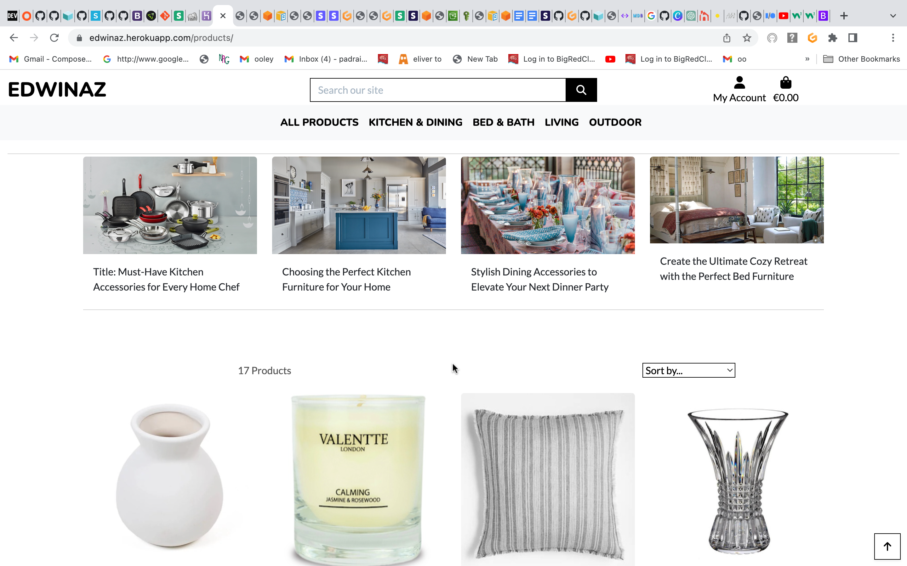

# **Edwinaz**

## **INTRODUCTION** 



Edwinaz is an online multi-vendor ecommerce website for the promotion of homeware good and was created for educational purposes as part of the Code Institute’s portfolio 5 (e-commerce applications) full stack development course.

Developed using HTML, CSS, JavaScript and Python on a Django framework.

View live project here [link to deployed link](https://edwinaz.herokuapp.com/)


## **TABLE OF CONTENT** 

  - [UX Design](#ux-design)
    - [Strategy](#Strategy)
    - [User stories](#User-stories)
    - [Scope](#Scope)
    - [Structure](#Structure)
    - [Skeleton](#Skeleton)
    - [Design](#Design)
  - [Features](#features)
    - [Existing features](#existing-features)
    - [Features left to implement](#features-left-to-implement)
  - [CRUD operations and defensive design](#crud-operations-and-defensive-design)    
    - [CRUD operations](#crud-operations)
    - [Defensive design](#defensive-design)
  - [Technologies Used](#technologies-used)
    - [Languages](#languages)
    - [Databases platform and cloud storage](#database-platform-and-cloud-storage)
    - [Libraries and frameworks](#libraries-and-frameworks)
    - [Other technologies](#other-technologies)  
  - [Testing](#testing)
    - [Introduction](#introduction)
    - [Code validation](#code-validation)
    - [Testing User stories](#testing-User-stories)
    - [Automated testing](#automated-testing)
    - [Responsiveness and compatibility](#responsiveness-and-compatibility)
    - [Testing performance](#testing-performance)
    - [Testing accessibility](#testing-accessibility)
    - [Interesting issues and known bugs](#interesting-issues-and-known-bugs)
  - [Deployment](#deployment)
    - [Deployment of the page](#deployment-of-the-page)
    - [How to run the code locally](#how-to-run-the-code-locally)
   - [Credits](#credits)
     - [Code](#code)
     - [Content](#content)
     - [Media](#media)
     - [Acknowledgment](#acknowledgments)

## **UX DESIGN**

 - ### **Strategy**  

Edwinaz is a fully functional responsive multi-vendor e-commerce platform with the home owner in mind who is interested in home decoration and home improvement as it target audience. The site offers informative articles on home improvements where the visitors can browse through blog like articles developed by the administrator and vendors of the site on home improvement ideas. 
It provides a platform for registered vendors to display their range of products they wish to promote on the platform and also offers them an article post option where the vendor can write informative articles which will act as both an informative source for prospective customers and also an opportunity to gain prominence on search engines by implementing good search engine optimisation.
   
- #### **Site Owner's Goals**
  - To carve out a presence in the home improvement online sector.
  - To connect with target audience of home improvement enthusiasts.
  - To offer site users informative articles that are of interest.
  - To provide a platform for vendors to upload their products and articles.

- #### **User Goals** 
  - To be presented with an informative and well designed responsive platform to browse home improvement products and articles.
  - To be able to order multiple items from different vendors on one site.
  - To be able to adjust order conveniently during purchase session.
  - To be able to save profile and delivery details.
  - To view orders made previously.

- ### **E-Commerce Business Model**
Objective of this project is to sell directly to individuals, a Business-to-Customer (B2C) model, where the customer makes a single payment for goods purchased and there are no subscriptions charges or repeating fees. Even though the business sells its products through different vendors directly to the customer, there is no involvement of any third parties in the model.

- #### **Marketing Goals**
Marketing of the site would take many different stategeis. The site's target audience are home makers that are interested in current trends in home decoration, homeware, home improvement and bringing these ideas into their own home. With a relatively modest budget for marketing the site owner's strategy is to use social media marketing to promote the site at it's target audience. Social media platforms Facebook, Instagram, Youtube, WhatsApp, Pinterest, TikTok and many others provide a channel to their audience that can be utilised at a free or a relatively competitive charge. A comprehensive marketing strategy would include regular feeds into a selection of these channels. Facebook's presence as a social media platform is a good match for the Edwinaz target audience as it's audience is older and more mature. 
- Showcase the site by publishing informative, engageing content on a regular basis. Use facebook's pages to spread your marketing message to a much larger audience.
- Build brand awareness at every opportunity. Include your logo and site's slogan on all communication. Use eye catching colours and fonts that will be memorable to new customers.
- Generate leads by using call to action landing pages, emails and offers.
- Engage with customers and followers. Respond to enquiries and comments from customers offering them a positive experience every time they engage with your site or social media portal.
- Drive sales through e-mail marketing by bringing special offers to your customer.


- #### **SEO & Keyword Research**
Keyword research forms the foundation of any successful SEO strategy. Identify relevant keywords and phrases that the site's target audience is likely to use when searching for homeware products. Working with tools sucj as wordtracker.com, Google Keyword Planner or SEMrush can assist in finding popular keywords but using the free version of these packages will not produce sufficient search results as keywords are limited.
Keywords and phrases after brainstorming, keyword research, using Google auto-fill and related terms resulted in the following:

    <meta name="description" content="Buy homeware, soft furnishings, household gifts, bed linen, home decor, housewarming gifts, furniture and designer makeover products at Edwinaz .Our shop provide quality, refined dining room, living room and bedroom furniture. Edwinaz is a comprehensive lifestyle and homeware online store.">

    <meta name="keywords" content="homeware,house warming presents and gifts,interiors,modern,urban,contemporary,stylish,bohemian,rustic,chic,classic,high end,lifestyle,wedding gift,home,furniture,">


 Keywords are then introduced into website's content, meta tags (as shown above), headings, and product descriptions. This increase the chance of ranking higher in search engine results.

 
Creating high-quality and engaging content is essential not only for attracting search engine attention but also for captivating your website visitors. Articles, and guides that are informative, useful, and relevant to the site's target audience's interests are uploaded by vendors on a regular basis to build  an affinity with the site's audience. Typical ideas include home decor tips, DIY projects, and product reviews. Chosen keywords are incorporated naturally into the content which strives to provide value to readers, encouraging them to spend more time on the website and increasing the likelihood of conversions.


Detailed and optimised product descriptions are crucial for both search engines and potential customers. Each vendor crafts a unique and compelling descriptions for each product, highlighting their features, benefits, and any relevant keywords. Extra fields, categories and style accommodate a structured attachment of certain keywords with products. The use of high-quality images, that showcase products and articles, optimise the image alt tags with relevant keywords improves the accessibility of the website but also enhances chances of appearing in image search results. 
Responsive website design which is optimised for mobile devices increases the number of users browsing and making purchases through their smartphones. Mobile friendly design ensures that the website looks and functions well on any device, improving user satisfaction and search engine rankings. 


Optimise Facebook page by including relevant keywords in the page name, About section, and post descriptions. The use of cover photos and copy that reflects brand's identity is replicated on Facebook page and posts. Regular updates, including product showcases, home decor inspiration, and tips related to your homeware niche are uploaded to Facebook page.


- ### **User Stories** 

- #### **Navigation**
      1. - As a user I want to be able to view the site on desktop, tablet and phone so that I can view the site with ease on each device
      2. - As a user I want to be able to view a catalogue of products so that I can select products to purchase
      3. - As a user I want to be able to click on a product so that I can view more details about this product
      4. - As a user I want to be able to select a category of products so that I can view products I am interested in and avoid searching through all of the products
      5. - As a user I want to be able to view all of the products from a vendor so that I can select the products from the vendor's product list that I like
      6. - As a user I want to be able to view all articles from a listed vendor so that I can view articles of interest from that particular vendor
      7. - As a user I want to be able to search for product in name or description field so that I can find a product I want to buy
       
- #### **Registration and account management** 
      8. As a user I want to be able to register for an account so that I can place orders, save my details and view previous orders
      9. As a site user I want to be able to easily login and log out so that I can access my personal information and so that my history and address details are saved
      10. As a site user I want to be able to have a personal user profile so that I can view my personal history and order confirmation, and save my payment information
      11. As a site user I want to be able to receive an email confirmation after registering so that I can verify my account registration was successful
      12. As a site user I want to be able to recover my password should I forget it so that I can recover access to my account

- #### **Shopping and Checkout**
      13. As a shopper I want to be able to add products to cart so that I can purchase the items I want
      14. As a shopper I want to be able to select a product and quantity so that I can purchase multiple products
      15. As a shopper I want to be able to view items in my cart so that I can see all my purchases, their subtotal cost and total for cart
      16. As a shopper I want to be able to adjust or remove items in my cart so that I can easily make changes to my purchases before I check out
      17. As a shopper I want to be able to easily enter my card details so that I can check out and complete purchase
      18. As a shopper, I want to receive confirmation for my order so that I can have a proof of purchase
      19. As a shopper I want to be able to feel my personal and payment information is safe and secure so that I can confidently provide needed information to complete purchase
      20. As a shopper I want to be able to view an order confirmation so that I can make sure that I haven't made an error
    

- #### **Vendor Functions**
      21. As a user I want to be able to log onto site and request to be register as a vendor so that I can become a vendor and promote my products for sale
      22. As a vendor I want to be able to view my product list so that I can ensure its up to date
      23. As a Vendor I want to be able to add a product so that I can expand my inventory for sale
      24. As a Vendor I want to be able to edit my products so that I can keep my inventory up to date
      25. As a Vendor I want to be able to delete a product so that I can keep my inventory up to date
      26. As a Vendor I want to be able to view my list of articles so that I can keep up to date with my articles
      27. As a Vendor I want to be able to add new articles so that I can add informational posts and promote my products
      28. As a vendor I want to be able to edit my articles so that I can keep my articles up to date
      29. As a vendor I want to be able to delete articles so that I can keep my articles up to date

- #### **Newsletter**
      30. As a shopper I want to be able to sign up for a newsletter so that I can be emailed with regular updates from website
      31. As a shopper I want to be able to unregister for receiving newsletters so that I can opt out of receiving any further newsletters should I wish

- #### **Admin** 

      32. As an admin I want to be able to add edit and delete articles and products so that I can keep site functional and up to date
      33. As an admin I want to be able to view and manage orders received so that I can ensure that orders are processed in a timely manner
       
- ### **Scope**

    - #### **Features**

    
      Edwinaz website is developed to demonstrate coder’s competence in delivering a django application which complies with Code Institute's PP5 criteria.

- #### **Functional requirements**
    - To be able to login and logout
    - To be able to sign-up using email address and secure password
    - To be able to reset password 
    - To be able to view and edit profile information
    - To be able to add/view/edit/delete a product as vendor
    - To be able to add/view/edit/delete an article as vendor
    - To be able to view and edit shopping bag
    - To be able to process orders and add order to profile history
    - To be able to process card payement
    - To be able to sort shop items according to a set of criteria 
    - To be able to email notification to users
    - To be able to notify user on success of failure on actions  
    - To be able to handle errors: page 404 not found, page 500 Internal Server Error and page 403 access denied
        
    
- #### **Non functional requirements**
    - Incorporate a narative in articles that will engage visitors to revisit site and view content.

  - #### **Becoming a Vendor**
    - The process of vendor setup is simplified for the purpose of this project
    - After registering and logging in the user can request to be a vendor by clicking on 'become vendor' in footer
    - Although in reality the become vendor process would be a more arduous process the request to become vendor is sanctioned instantly
    - The privileges of being able to add, edit, list and delete products and posts are conferred to the vendor
  
  - #### **Vendor and Admin Content generation**
    - Articles to be generated by vendors and admin.
    - Admin are able to add, edit and delete articles and products
    - Image to be included in article along with title, content and excerpt.
    - Vendor are able to add, edit and delete articles and products.
    - Details of product include product image, name, category, style, description and price.
    - The use of forms where user input is required.
    - Text and headings to identify main sections of the site.
    - The use of icons for visual conciseness. 

    
  - ### **Structure**

  - #### **Functionality and Content**

    - Header section to include site name logo and navigational links with collapsible menu on small screens.
    - The homepage  will consist of a hero image and links to articles and products.
    - About page to include information about the company and its vendors.
    - Products page to include a selection of products.
    - Products to be filtered by selection in navigation bar.
    - Article page to include articles for visitor to brouse through.
    - Shopping bag page to display items added in the bag, price, delivery cost, total and options to change quantity.
    - Profile page to allow user to update their information and also to view older orders.
    - Article page to display articles published by vendors and provide links to add, edit and delete articles to vendor with privaleges. 
    - Product page to display products published by vendors and provide links to add, edit and delete products to vendor with privaleges.
    - Footer to include links to about, contact, social media, newsletter sign-up and become vendor link.

  - #### **Interaction design**

    - Collapsible menu
    - Collapsible footer
    - Responsive design with mobile first approach

  - #### **Database structure**

    The database structure is shown below:
    .

    
    - **User**
      - Allauth is used for registration of user upon signing up

    - **UserProfile model**
      - A one to one relationship is made with Auth User model.
      - Other information such as full name, phone number and address can be updated at checkout or on profile page.
      - is_vendor boolean field is used to identify if the user is a vendor and confer vendor privilages
      - The order models has a foreign key relationship to this model to easily retrieve users' order details.

    - **Category model**
      - Category model has two fields, name and friendly name.
      - The product models has a foreign key relationship to this model to easily identify categories in products.

    - **Style model**
      - Style model has one field, name field, which holds the style type of the product which could be used for filtering.

    - **Product model**
      - Product details such as name, description, category, style, sku, price and image have their own fields in this model.
      - User and vendor fields create a foreign key relationship to this models UserProfile and Vendor.
    
    - **Order model**
      - Customer details such as full name, address, email, phone number are stored as fields in this model.
      - Order number, automatically generated, grand total, delivery cost and order total are stored in fields also. 
      - Original bag and strip pid fields are used in verifying payment and order recording.
      - User profile field has a foreign key relationship with UserProfile model.

    - **OrderLineItem model**
      - Order details that have been added to the user’s shopping bag is stored here.
      - Order field has a foreign key relationship with order model.
      - Product field has a foreign key relationship with product model.
      - The quantity field holds the quantity of product purchased.
      - Line item total records the product of quantity and product price.
    
    - **Vendor model**
      - The vendor model stores the vendor's name in one field.
      - A one to ine field, created by, points to the user model.
      
    - **Post model**
      - The post model is used to hold article information posted by vendors.
      - It consists of title, content, excerpt, image and date added fields.
      - A user field has a foreign key relationship with UserProfile model which can be checked if is_vendor true.

- ### **Skeleton**
    
- ### **Wireframes**

     

    Please find below links to a selection of wireframe used for this project (png format)
      - [Homepage](documentation/wireframes/home.png)
      - [Products](documentation/wireframes/products.png) 
      - [Articles](documentation/wireframes/articles.png)
      - [Article Detail](documentation/wireframes/article-detail.png)
      - [Add an Article](documentation/wireframes/add-article.png)
      - [About page](documentation/wireframes/about.png)
      - [Product details](documentation/wireframes/product-detail.png)
      - [Add Product](documentation/wireframes/add-product.png)
      - [Shopping bag](documentation/wireframes/shopping-bag.png)
      - [Checkout page](documentation/wireframes/checkout.png)
      - [Thank You page](documentation/wireframes/thank-you.png)
      - [Sign up page](documentation/wireframes/sign-up.png)
      - [Login page](documentation/wireframes/log-in.png)
      - [Profile page](documentation/wireframes/profile.png)
      - [Add article](documentation/wireframes/add_c.png)
      - [Error page](documentation/wireframes/404.png)
      - [Vendor page](documentation/wireframes/vendor.png)
      - [Newsletter Subscribe page](documentation/wireframes/newsletter-subscribe.png)

    - #### **Difference to implement**
      - Sections in the profile pages feature own dedicated pages
      - Articles details feature a panel above products and details articles posted by vendor.
      - Product page needed, instead users will have access to each individual products using a search
      - Saved items saved to cart
      - Line items in the shopping bag can be modified.

 - ### **Surface / Design** 

     The website will feature a simple, modern design, with minimum colours to keep the emphasis on the products.

    - #### **Imagery**

       The website features images from vendor's posts and products. Images of products are 450x450 pixels with image filling most of card and a white backgroun. This is to keep site simple and clean. The images used in the article section of vendor post is 800x450 pixels 

    - #### **Colour scheme**
 
       Appart from the hero image black and white are the main colours, the website will use mostly black and white with some additional colours for interactive purposes.
       The website will use the following colour palette, which was custom-made and checked for accessibility using Adobe Color:

              

     - #### **Typography**
        As the design of the website is to be clean and simple, two fonts were chosen to reflect this. The website uses the Nunito Google font for headings and titles. Font weight of 800 is used predominatly which gives a strong bold look for headings:

         
        
         The Lato font is used for general text in line with the site's overall clear and simple style. Font weight of 400 is used throughout and is distinctive and easy to read.

         


     - #### **Icons**
       Icons by font-awesome are used throughout the website to allow users to quickly access functionalities such as adding items to the shopping cart and also used to in footer to link to social media accounts. They are also associated with representing product and article fields and easily identify date as a calander, vendor as a cart, category as a tag etc. 

     - #### **Styling**
        Horizontal lines to structure and make the content of the website easy to read.
        Slightly rounded edge borders and buttons for a more user friendly and inviting interface.
       


## **FEATURES**

  - ### **Existing features**
  
    Implemented features can be found in [this document](documentation/features/features.md).
 
  - ### **Features left to implement**
  	- Additional thumbnail images for product details 
  	- Pagination on shop when displaying all items 
  	- Full content management to display and update content on the homepage and other static pages
  	- Improved user interface for the vendor to manage articles and products.
    - Integration with paypal
    - Allauth integration with social media platform

## **CRUD operations and defensive design**

  - ### **CRUD operations**
    Operations | all user | auth. user | Vendor/admin |
    --- | --- | --- | --- 
    View homepage | Yes | Yes | Yes |
    View about page | Yes | Yes | Yes |
    Add/edit/delete article | No | No | Yes |
    Add/edit/delete categories | No | No | Yes |
    View shop | Yes | Yes | Yes |
    View product details | Yes | Yes | Yes |
    Add/edit/delete articles | No | No | Yes |
    Add/edit/delete products | No | No | Yes |
    View add to bag | Yes | Yes | Yes |
    Checkout page | Yes | Yes | Yes |
    Login | No | Yes | Yes |
    Register | Yes | No | No |
    View profile | Yes | Yes | Yes |
    Edit profile | No | Yes | Yes |
    View order history | No | Yes | Yes |
    View order details | No | Yes | Yes |


  - ### **defensive design**

    - #### **Delete operations**
      Users first need to confirm that they are sure that they want to delete the specifified product

    - #### **Adding quantity of a specified item to the shopping bag**
      - The options for quantity to be added to the shopping bag are limited to stock availability 
      - Users cannot add an item out of stock to their shopping cart and the button 'add to cart' to be removed from page when items are out of stock.

    - #### **Articles and product status**
     

    - #### **Add/edit/delete articless**
      - Conditions in place to ensure that only the superuser and vendor can add/edit/delete articles
      - If an article has been posted, it can be seen by all visitors to site.

    - #### **Add/edit/delete products**
      - Admin can add products and assign then to vendor. 
      - Admin can edit and delete any of the products.
      - Vendor can add and delete products on their own store.

    - #### **Checkout page**
      - Users can order and not set up an account but will not have their order saved to their profile.

## **Stripe as a Payment Method**

  Stripe was selected as payment method for the following consideration:  
  - Ease of implementation and customisation 
  - Well documented and maintained. 
  - Paypal as a option for method of payement in future.   
  

## **TECHNOLOGIES USED**

  - ### **Languages**
    - [HTML](https://html.spec.whatwg.org/multipage/)
    - [CSS](https://www.w3.org/Style/CSS/Overview.en.html)
    - [Javascript](https://developer.mozilla.org/en-US/docs/Web/JavaScript)
    - [Python](https://www.python.org/)

  - ### **Databases and Cloud storage**
    - [SQlite](https://www.sqlite.org/index.html): SQL development database integrated by default as part of Django framework
    - [ElephantSQL](https://www.elephantsql.com/): SQL database service provided by Elephant SQL for database management
    - [Heroku](https://www.heroku.com/): Deployment application to run production ready dynamic programs
    - [Amazon AWS S3](https://aws.amazon.com/s3/): Static files storage bucket for image files in production
    - [Stripe]*(https://stripe.com): Payment gateway
   

  - ### **Libraries and Frameworks**
    - [Django](https://www.djangoproject.com/): Django 3.2 Long Term Support version, Python web framework for dynamic development of front and backend projects
    - [Font Awesome](https://fontawesome.com/): Icon repository used for icons used on the site
    - [Google font](https://fonts.google.com/): Font family warehouse for selecting fonts for website design
    - [Jquery](https://jquery.com/): A simplified DOM manipulation tool for developong JavaScript code
    - [Gunicorn](https://gunicorn.org/): Server to support WSGI HTTP deployment of Django applications
    - [Pillow](https://pypi.org/project/Pillow/) Python library for working with images
    - [Bootstrap4](https://getbootstrap.com/docs/4.0/getting-started/introduction/): Template for responsive web development
    - [Django allauth](https://django-allauth.readthedocs.io/) Authentication, registration, login/log out
    - [Django Crispy FormS](https://django-crispy-forms.readthedocs.io/en/latest/): Django forms rendering app
    - [Django-countries](https://pypi.org/project/django-countries/): Django pre-built country field app supporting valid country codes
    - [Mailchimp-marketing](https://mailchimp.com): Mailchimp newsletter app for integrating newsletter mail on site
   
   

  - ### **Other technologies**
    - [Canva](https://canva.com/): Online graphic design tool for editing images
    - [Balsamiq](https://balsamiq.com/): Wireframe design tool for mocking up pages on devices
    - [Lucidchart](https://www.lucidchart.com/): Flow chart design tool
    - [W3C Markup Validation Service](https://validator.w3.org/): HTML validation
    - [W3C CSS Validator](https://jigsaw.w3.org/css-validator/): CSS validation
    - [WAVE Web Accessibility Evaluation Tool](https://wave.webaim.org/): Web accessibility
    - [PEP8 online](http://pep8online.com/): Python validation
    - [JSHint](https://jshint.com/):  jquery/javascript validation
    - [Chrome DevTools](https://developer.chrome.com/docs/devtools/): Google development tool to test site responsiveness and errors
    - [Google lighthouse](https://developers.google.com/web/tools/lighthouse): Google lighthouse tool forsite  performance assessment
    - [Xml Sitmap](https://www.xml-sitemaps.com/) Site map generator
    - [Wordtracker](https://www.wordtracker.com/) Keyword research tool


## **TESTING**

  - ### **Introduction**
    The website was tested as it was being developed using:
    - Chrome developer tools and Firefox developer tools
    - Use of console.log() in JS testing to check if code is functioning 
    - Viewing terminal for backend functionalities by printing expected outcome
    - Manual testing of user stories
    - Site navigation and functionality
    - A sample of unit tests were conducted 'home' and 'blog' app 

  

  - ### **Manual testing**
  ### Testing User Stories

| ID | As a | I want to be able to  | So that I can | Achieved by | Evidence |
| :--- | :--- | :--- | :---| :--- | :---: |
| 1 | Shopper | view a catalogue of products | select products to purchase | Home page leads to Product or Article page. The product page provides a sample of articles followed by a full catalogue of products. Users can easily access to their account, shopping bag, search bar and the product categories.   | [Large Screen Navbar](documentation/testing/user-stories/large-screen-nav-bar.png) & [Small Screen Navbar](documentation/testing/user-stories/mobile-nav-bar.png) |
| 2 | Shopper |register for an account  | place orders, save my details and view previous orders | Visitors can register for an account via the account section in the navbar, available on all pages of the site. If visitor doesn't have an account setup before checkout, they are given an option to create an account, or they can just fill in their details and not register. | [Register](documentation/testing/user-stories/register.png) |
| 3 | Shopper | click on a product  | view more details about this product | When shopper clicks on a product, they will be taken to the product detail page which lists more information such as the item name, category, style, vendao name, price and full description. If shopper wishes to view a larger image of product, they can click on the image and a larger version of the image will open in a new browser tab.  | [Product Details](documentation/testing/user-stories/product-detail.png) |
| 4 | Shopper | select a category of products | view products I am interested in and avoid searching through all of the products | When shopper clicks on a category, a dropdown displays a breakdown of items within that category. Shopper has the choice to refine the products search by selecting the sub-categories of the category. | [Category](documentation/testing/user-stories/category-dropdown.png) |
| 5 | Shopper | view all of the products from a vendor | select the products from the vendor's product list that I like | A shopper that purchases or likes a product from a vendor, might like other products from that vendor. By selecting vendor from products dropdown the shopper can view the products from each vendor grouped together. Thus a shopper can make a choice to view that vendor's products without searching the whole product listing. | [View Vendor List](documentation/testing/user-stories/view-vendor-products.png) |
| 6 | Shopper | search for product in name or description field | find a product I want to buy | Shoppers are able to search all products and their descriptions for search terms they are interested in. By typing in search term into the search box and clicking on search icon (or RETURN) a search will be performed resulting in displaying only products with search term in product name or in product description. This will narrow the number of products that the shopper will have to view.| [Search](documentation/testing/user-stories/search-soft.png) |
| 7 | Shopper | add products to cart | purchase the items I want | Shopper can proceed with process of purchasing product by adding it to shopping bag. after selecting product and clicking on 'add to bag' a pop-up confirms success in adding the product to bag. At this point the shopper is given the option to proceed to checkout. | [Add product to cart](documentation/testing/user-stories/add-product-to-bag.png) |
| 8 | Shopper | select a product and quantity | purchase multiple products | Shopper can select to purchase multiples of product selected by clickiing on the '+' or '-' element in the quantity field (or by typing in the required number in quantity field). | [Quantity](documentation/testing/user-stories/quantity.png) |
| 9 | Shopper | view items in my cart | see all my purchases, their subtotal cost and total for cart | Shopper By clicking on the bag icon in top nav bar the shopping bag is displayed. Here all the items in the bag are shown, their quantity, line item total, grand total, delivery cost, and a prompt for free delivery if total is not above free delivery threshold. | [Shopping bag](documentation/testing/user-stories/shopping-bag.png) |
| 10 | Shopper | adjust or remove items in my cart | easily make changes to my purchases before I check out | Shopper is able to adjust quantity and delete item in shopping bag before proceeding to checkout. This is to give a better user experience and make the process adaptable to the user's needs. | [Adjust / delete items](documentation/testing/user-stories/adjust-delete-bag.png) |
| 11 | Shopper | easily enter my card details| check out and complete purchase | On the checkout page the shopper can see clearly the information that is need to be completed to complete their order, their details, the delivery information and the card payment information. Payment success will be displayed on completing the checkout. | [Payment details](documentation/testing/user-stories/checkout.png) |
| 12 | Shopper | view all articles from a listed vendor | view articles of interest from that particular vendor | By Clicking on ARTICLES in main nav bar the shopper can select articles to be viewed. At time of writting the option to view specific vendor's article listing was not implemented and would be need to be implemented | [Article list](documentation/testing/user-stories/articles.png) |
| 13 | Shopper | feel my personal and payment information is safe and secure | confidently provide needed information to complete purchase | Shoppers feel comfortable using trusted payment gateway providers such as stripe. Stripe API is integrated to site so that you are not diverted to a new tab or website which provide for better user experience and confidence. | [Credit card ](documentation/testing/user-stories/credit-card.png) |
| 14 | Shopper | view an order confirmation | make sure that I haven't made an error | Shopper is brought to Thank You page and a confirmation is displayed in right corner. | [Order success](documentation/testing/user-stories/order-success%20.png) |
| 15 | Shopper | receive a confirmation email | have confirmation for my record | Upon successful checkout, the shopper will be sent a confirmation email to the email address provided at checkout to confirm their order details.  | [Checkout email](documentation/testing/user-stories/us-15.png) |
| 16 | Shopper |  have a personal user profile | view my personal history and order confirmation, and save my payment information | By clicking on 'My Account' and then 'My Profile' users can enter their name, phone number, email address and full address to the site and have this information stored for future transactions. Also user profile allows user to view previous order history.  | [Personal User Profile](documentation/testing/user-stories/profile.png) |
| 17 | Shopper | register for account | have a personal account and view my profile | To avoid adding personal details and address when ordering from site the user can register for an account and the details entered on first order is saved for future transactions. | [Register for account](documentation/testing/user-stories/confirm-email-address.png) |
| 18 | Shopper | easily login and log out| access my personal information and so that my history and address details are saved | Shopper can easily log in and log out with full access to order history and shipping details. | [Log in / log out](documentation/testing/user-stories/signin-signout.png) |
| 19 | site user | receive an email to confirm my email for registering | verify my email and register successfully | It is important to verify that the email address is that of the user. By sending an email to the email address provided and requiring a confirmation acknowledgement - a simple check that the user has access to the email is confirmed. | [Register email](documentation/testing/user-stories/confirm-registration.png) |
| 20 | Shopper | recover my password should I forget it | recover access to my account | By clicking on 'forgot password' the user is prompted to enter their email address for a recovery email to be sent to. | [Reset Password](documentation/testing/user-stories/password-reset.png) |
| 21 | Shopper | receive an email to reset my password  |  securely reset my password |  User is sent an email to the email address provided (if it is a registered email) and in this email the user can select option to reset their password.| [Reset Password Confirmation email](documentation/testing/user-stories/reset-password-email.png) |
| 22 | Shopper | add multiple items to cart | purchase more than one item | e | [Update cart](https://stripe.com/docs/security?locale=en-GB) |
| 23 | Shopper | review my cart items | add, increase or delete products in my cart | . | [Update cart](documentation/testing/user-stories/user-checkout.png) |
| 24 | Shopper | enter my card details | complete checkout | Upon successful checkout, a user will be sent a confirmation email to the email address provided at checkout to confirm their order. | [Email Confirmation](documentation/testing/user-stories/us-24.png) |
| 25 | Shopper | enter my delivery details | have my purchase delivered | . | [User profile](documentation/testing/user-stories/us-25.png) |
| 26 | Shopper | save my delivery details | keep my profile on record save on entering details again | . | [Delivery Details](documentation/testing/user-stories/us-26.png) |
| 27 | Registered User | view previous orders | maintain a record of previous purchases | . | [Vendor product list](documentation/testing/user-stories/us-27.png) |
| 28 | Vendor | view my product list | ensure its up to date | . | [Vendor product list](documentation/testing/user-stories/us-27.png) |
| 29 | Vendor | add a product | expand my inventory for sale | . | [Vendor add product](documentation/testing/user-stories/us-27.png) |
| 30 | Vendor | edit my products | keep my inventory up to date | . | [Vendor edit product](documentation/testing/user-stories/us-27.png) |
| 31 | Vendor | delete a product | keep my inventory up to date | . | [Vendor edit product](documentation/testing/user-stories/us-27.png) |
| 32 | Vendor | view my list of articles | keep up to date with my articles | . | [Vendor article list](documentation/testing/user-stories/us-27.png) |
| 33 | Vendor | add new articles | add informational posts and promote my products | . | [Vendor edit product](documentation/testing/user-stories/us-27.png) |
| 34 | Vendor | edit my articles  | keep my articles up to date | . | [Vendor article update](documentation/testing/user-stories/us-27.png) |
| 35 | Vendor | delete articles | keep my articles up to date | . | [Vendor article delete](documentation/testing/user-stories/us-27.png) |
| 36 | Shopper | sign up for a newsletter | be emailed with regular updates from website | . | [Newsletter signup](documentation/testing/user-stories/us-27.png) |
| 37 | Shopper | sign up for a newsletter | be emailed with regular updates from website | . | [Newsletter signup](documentation/testing/user-stories/us-27.png) |
| 36 | Shopper | sign up for a newsletter | be emailed with regular updates from website | . | [Newsletter signup](documentation/testing/user-stories/us-27.png) |
| 37 | Shopper | view the site on desktop, tablet and phone | view the site with ease on each device | . | [Site responsive](documentation/testing/user-stories/us-27.png) |
| 38 | Shopper | receive confirmation for my order | have a proof of purchase | . | [ Order confirmation](documentation/testing/user-stories/us-27.png) |
| 39 | vendor | manage my orders | process orders and monitor sales and inventory | To process orders efficiently and maintain records of what products are selling the vendor needs to have access to ordes placed on the website. At present this function is only partly availabe through admin panel but would be a desirable feature for future development.  | [Vendor Order Management](documentation/testing/user-stories/order-detail.png) |
| 40 | Shopper | unregister for receiving newsletters | opt out of receiving any further newsletters should I wish | Should a registered user sign up for email newsletters and then decide not to receive any more newsletters this option to unsubscribe is available in footer and all user needs to do is enter their email address and unsubscribe.| [Newsletter opt out](documentation/testing/user-stories/unsubscribe.png) |
| 41 | Admin | add edit and delete articles and products | As an admin I want to be able to add edit and delete articles and products so that I can keep site functional and up to date | Selecting 'Add Product' or 'Add Article' from 'My Account' dropdown as admin the admin has access to adding products or articles forms. While logged in as admin and viewing products or articles the admin has options 'edit' or 'delete' under each product. By clicking on these the admin can either delete or edit products/articles. | [Admin Product & Article CRUD](documentation/testing/user-stories/admin-crud.png) |
| 42 | Admin | view and manage orders received | ensure that orders are processed in a timely manner | Admin logging into admin panel can select orders and view each individual order. As the orders are processed further functionality could be introduced to indicate that the order is completed. | [Mange orders](documentation/testing/user-stories/admin-orders.png) |

  - ### **Site navigation and functionality**
    A manual test of the navigation and functioning of each element was conducted with relevant conditions, i.e. not logged in, logged in as shopper, logged in as vendor and logged in as admin. A description of test is outlined and comment on result noted.
    

  - ### **Automated testing**

    Django provides a testing framework that makes it easy to write automated tests for applications. The testing framework allows developers to write tests for views, models, forms, and other components of the application.
    Certain limitations arise to the Django framework when it comes to testing. One limitation is that the testing framework does not provide support for testing JavaScript, HTML and CSS. Testing complex database queries can be challenging as it requires creating test data and verifying the results.
    Unit tests are automated tests that are used to test individual components of an application and are written using the built-in testing framework. They are essential for detecting errors and ensuring that individual components of the application are functioning correctly. In this project, a sample of 17 unit tests were created, to test views and form functionality of the 'Home' and 'blog' apps. All tests passed. The unit tests are included in the app's tests.py and test_forms.py files. A screenshot of the result is shown below.
    
  
  - ### **Code validation**

  - #### **W3C HTML Code Validator**
    Each page for the website was run through the [W3C Markup Validation Service](https://validator.w3.org/) and returned no errors. 
    As all web pages are rendered dynamically using Jinja template, each page and scenario had to be validated by direct input by copying and pasting the source code for the page.

| Page | Result | Evidence |
| :--- | :--- | :--- | 
| Home | PASS | [home](documentation/validation/html/index.png)
| About | PASS | [About](documentation/validation/html/about.png)
| Bag | PASS | [Bag](documentation/validation/html/bag.png)
| Blog | PASS | [Blog](documentation/validation/html/blog.png)
| Blog/add | PASS | [blog/add](documentation/validation/html/blog-add.png)
| Blog Edit | PASS | [blog/edit/blog-id](documentation/validation/html/blog-edit-3.png)
| Blog Delete | PASS | [blog/delete/blog-id](documentation/validation/html/blog-delete-3.png)
| Marketing| PASS | [marketing](documentation/validation/html/marketing.png)
| Products | PASS | [products](documentation/validation/html/products.png)
| Product Detail | PASS | [products/product-id ](documentation/validation/html/products-3.png)
| Product Add| PASS | [products/add](documentation/validation/html/products-add.png)
| Product Edit | PASS | [products/edit/product-id](documentation/validation/html/products-edit-3.png)
| Product Delete | PASS | [products/delete/product-id ](documentation/validation/html/products-delete-3.png)
| Profile | PASS | [profile](documentation/validation/html/profile.png)
| Vendor | PASS | [vendor](documentation/validation/html/vendor.png)
| Vendor Add Product| PASS | [vendor/vendor_add_product](documentation/validation/html/vendor-add-product.png)
| Vendor Edit Product | PASS | [vendor/vendor_edit_product](documentation/validation/html/vendor-edit-product-3.png)
| Vendor Delete Product | PASS | [vendor/vendor_delete_product/product-id](documentation/validation/html/vendor-delete-product-3.png)
    
- ### **W3C CSS Jigsaw Validator**

  Each CSS file was tested with [W3C CSS Validator](https://jigsaw.w3.org/css-validator/) via direct input and returned no errors

| Page | Result | Evidence |
| :--- | :--- | :--- | 
| Base | PASS | [static/css/base](documentation/validation/css/base-css.png)
| Checkout| PASS | [checkout/css/checkout](documentation/validation/css/checkout-css.png)
| Profiles| PASS | [profiles/static/css](documentation/validation/css/profile-css.png)


- #### **JSHint validator**
  Javascripts files were tested with [JSHint](https://jshint.com/) and returned no errors except for stripe scripts and minor warnings. 

| JS function | Evidence |
| :--- | :--- | 
| Update quantity | [Update-quantity](documentation/validation/js/update-qty-onclick.png)
| Remove item | [Remove-item](documentation/validation/js/remove-item.png)
| Scroll to top | [Scroll-to-top](documentation/validation/js/scroll-to-top.png)
| Stripe elements | [Stripe-elements](documentation/validation/js/stripe-elements.png)
| Sort and direction | [Sort-and-direction](documentation/validation/js/sort-direction.png)
| Quantity input | [Quantity-input](documentation/validation/js/quantity-input.png)
| New image helper | [New-image-helper](documentation/validation/js/new-image-helper.png)
| Countryfield | [Countryfield](documentation/validation/js/countryfield.png)


  - #### **Python 8**
  In this project [autopep8](https://gist.github.com/hygull/7db576c5d739e87832aa2341dbeb5242) is used to maintain compatibility with python validation PEP8. Autopep8, in some cases, was unable to break up lines and these long lines instances were left for code readibility. To show validation most of python files contents were cut and pasted into the Code Institute's Python Linter.

Screen shots of PEP8 code validation can be fount below:
| App | File | Evidence |
| :--- | :--- | :--- | 
|Edwinaz | Settings | [settings](documentation/validation/pep8/settings-lint.png)
| Edwinaz | Urls | [urls](documentation/validation/pep8/urls-lint.png)
| Bag | Views | [bag views](documentation/validation/pep8/bag-views-lint.png)
| Bag | Urls | [bag urls](documentation/validation/pep8/bag-urls-lint.png)
| Blog | Views | [blog views](documentation/validation/pep8/blog-views-lint.png)
| Blog | Urls | [blog urls](documentation/validation/pep8/blog-urls-lint.png)
| Blog | Test form | [blog test form](documentation/validation/pep8/blog-test-form-lint.png)
| Blog | Tests | [blog tests](documentation/validation/pep8/blog-tests-lint.png)
| Blog | Models | [blog models](documentation/validation/pep8/blog-models-lint.png)
| Checkout | Webhook | [checkout webhook](documentation/validation/pep8/checkout-webhook-lint.png)
| Checkout | Checkout Handler | [checkout webhook handler](documentation/validation/pep8/checkout-webhookhandler-lint.png)
| Checkout | Views | [checkout views](documentation/validation/pep8/checkout-views-lint.png)
| Checkout | Urls | [checkout urls](documentation/validation/pep8/checkout-urls-lint.png)
| Checkout | Forms | [checkout forms](documentation/validation/pep8/checkout-forms-lint.png)
| Checkout | Models | [checkout models](documentation/validation/pep8/checkout-models-lint.png)
| Home | Views | [home views](documentation/validation/pep8/home-views-lint.png)
| Home | Urls | [home urls](documentation/validation/pep8/home-urls-lint.png)
| Home | Tests | [home tests](documentation/validation/pep8/home-tests-lint.png)
| Marketing| Views | [marketing views](documentation/validation/pep8/marketing-views-lint.png)
| Marketing | Urls | [marketing urls](documentation/validation/pep8/marketing-urls-lint.png)
| Products | Views | [products views](documentation/validation/pep8/products-views-lint.png)
| Products | Urls | [products urls](documentation/validation/pep8/products-urls-lint.png)
| Products | Models | [products models](documentation/validation/pep8/products-models-lint.png)
| Products | Forms | [products forms](documentation/validation/pep8/products-forms-lint.png)
| Profiles | Views | [profiles views](documentation/validation/pep8/profiles-views-lint.png)
| Profiles | Urls | [profiles urls](documentation/validation/pep8/profiles-urls-lint.png)
| Profiles | Models | [profiles models](documentation/validation/pep8/profiles-models-lint.png)
| Profiles | Forms | [profiles forms](documentation/validation/pep8/profiles-forms-lint.png)
| Vendor | Views | [vendor views](documentation/validation/pep8/vendor-views-lint.png)
| Vendor | Urls | [vendor urls](documentation/validation/pep8/vendor-urls-lint.png)
| Vendor | Models | [vendor models](documentation/validation/pep8/vendor-models-lint.png)
| Vendor | Forms | [vendor forms](documentation/validation/pep8/vendor-forms-lint.png)


  - ### **Responsiveness and compatibility**
    The website was tested on the following devices and browsers:
    

    The website was also tested using Google Inspect and Responsive viewer
    

  - ### **Testing performance**
    Google Lighthouse was run on different pages, with performances ranging from 83% to 100% depending on the number of images on the pages. The page with the lowest performance is the shop page with all products displayed. Below is an extract of the reports:

    

  - ### **Testing accessibility**

    Since the website was developed using Django templating, each page was tested individually for accessibility with [WAVE Web Accessibility Evaluation Tool](https://wave.webaim.org/) and returned no errors except for Braintree hosted fields as the accessibility tools cannot identify labels for these fields.
    
    


  - ### **Issues and known bugs**

    - #### **Context**
      
      
    

    - #### **Display profile**
      

    - #### **Justifying**
  

    - #### **Gitpod**

      - **Change to gitpod and Code Institute template**


      - **Django variable to javascript**

   
    - #### **Known issues**

 
## **DEPLOYMENT**

  Edwinaz django e-commerse website was developed on loal environment and used gitpod's git-based version control system for versioning of the project. Gitpod's issues and project generating facility was used to record the Agile methodology project management approach that breaks the project into smaller phases. The site was developed with regular commits and used Code Institute's student template with changes frequently committed to git then pushed onto GitHub.
  The application is deployed on [Heroku](https://heroku.com/) with the repository hosted on Github and the postgres database hosted on [ElephantSQL](https://www.elephantsql.com/)

  - ### **Accounts setup needed**
    - Amazon AWS account
    - [Heroku](https://heroku.com/)
    - [ElephantSQL](https://www.elephantsql.com/)
    - [Mailchimp](https://mailchimp.com/)
    - [Stripe](kttp://stripe.com)
    - Gmail account with 2-step verification.
  
  - ### **Deployment**

    - #### **Database setup stage:**
      - Log onto elephantSQL, click on 'Create new instance' Name your instance: 'edwinaz', choose Tiny Turtle plan and choose region: eu-west-1, click 'Review' and then 'Create instance'
      - Log onto heroku, click on 'New' then 'Create new app'. Name it 'edwinaz' and choose a region close to where you are based: 'Europe' 
      - connect to Postgres database and deploy the app without static files
      - Create and connect Amazon bucket for storing images and static files

    - #### **Local environment**
      | KEY         | VALUE |
      | ----------- | ----------- |
      | DEVELOPMENT | True |
      | SECRET_KEY  | Your_value |
      | AWS_ACCESS_KEY_ID | Your_value |
      | AWS_SECRET_ACCESS_KEY | Your_value |
      | HEROKU_POSTGRESQL_AQUA_URL | Your_value |
      | MAILCHIMP_API_KEY| Your_value |
      | MAILCHIMP_MARKETING_AUDIENCE_ID | Your_value |
      | MAILCHIMP_REGION| Your_value |
      | PORT| 8000 |
      | STRIPE_PUBLIC_KEY| Your_value |
      | STRIPE_SECRET_KEY| Your_value |
      | STRIPE_WH_SECRET| Your_value |
      | USE_AWS| True |
      | EMAIL_HOST_USER | Your_value |
      | EMAIL_HOST_PASSWORD | Your_value |

    - #### **Create a Postgres instance on ElephantSQL**
      - Create new instance
       
      - Enter a name and select Tiny Turtle (free plan)
       
      - Go to select region and select closest region to you
       
      - Click review and create, you should then be redirected to the following page
       
      - Copy the URL

    - #### **Back up your current sqlite database**
      - Use datadump to preserve all data in development database 
      - Backup the current database and load it into a data.json file, by typing in CLI:
        ```python3 manage.py dumpdata  > data.json```
      - This data can be uploaded when deployed database is functioning.

    - #### **Load data from db.json file into postgres**
      - Create a temporary variable in your environement named: DATABASE_URL with the value of the Postgres URL from Heroku
      - In your local IDE, install these two packages by typing in the CLI:
	      - ```pip3 install dj_database_url```
	      - ```pip3 install psycopg2```
        - Then ```pip3 freeze > requirements.txt``` 
      - In edwinaz > settings.py, add ```import dj_database_url``` at top of the page
      - Connect your manage.py file to your postgres database      
          ```
          DATABASES = {
    		 'default':  dj_database_url.parse('DATABASE_URL')
	        }
          ```
      - Load your data from the data.json file into postgres by typing in the CLI: ```python3 manage.py loaddata data.json``` 
      - Migrate the database by entering: ```python3 manage.py migrate```
      - Create superuser: ```python3 manage.py createsuperuser``` 


    - #### **Prepare for deployment**
       - Install gunicorn using command in cli: ```pip3 install gunicorn```
       - Update requirement.txt by typing command in cli: ```pip3 freeze > requirements.txt```
      
         	 
    - #### **Change configuration to allow for production and development mode**
       - Secret Key: ```SECRET_KEY = os.environ.get('SECRET_KEY', '')```
       - Debug: ```DEBUG = 'DEVELOPMENT' in os.environ``` so that debug is true in your development environment, but false in production
       - Allowed Hosts: ```ALLOWED_HOSTS = ['edwinaz.herokuapp.com', 'localhost']``` 
      
       - Using an if statement in settings.py, the app will be connected to Postgres in production mode and SQlite when in development.
          ```
            if 'DATABASE_URL' in os.environ:
                DATABASES = {
                  'default': dj_database_url.parse(os.environ.get('DATABASE_URL'))
                }
            else:
                DATABASES = {
                    'default': {
                        'ENGINE': 'django.db.backends.sqlite3',
                    'NAME': os.path.join(BASE_DIR, 'db.sqlite3'),
                    }
                }
          ```
       - Update email settings so that email are sent in production and display in the console when in development environment:
         ```
         if 'DEVELOPMENT' in os.environ:
            EMAIL_BACKEND = 'django.core.mail.backends.console.EmailBackend'
            DEFAULT_FROM_EMAIL = 'edwinaz@example.com'
         else:
            EMAIL_BACKEND = 'django.core.mail.backends.smtp.EmailBackend'
            EMAIL_USE_TLS = True
            EMAIL_PORT = 587
            EMAIL_HOST = 'smtp.gmail.com'
            EMAIL_HOST_USER = os.environ.get('EMAIL_USER')
            EMAIL_HOST_PASSWORD = os.environ.get('EMAIL_HOST_PASS')
            DEFAULT_FROM_EMAIL = os.environ.get('EMAIL_USER')
         ```
       - Add, commit and push changes to github


    - #### **Create a webservice app on Heroku**

      - Log onto Heroku and click the "new" button in the top menu
      
      - Select the option "new webservice"
        
      - Search and select the relevant repo, then click connect
      - Enter a unique name for your application
      - Select the region closest to you 
      - Enter "main" as branch
      - Enter "Python 3" as runtime
          
      - Set the build command as ```./build.sh```
      - Set the start command as ```gunicorn edwinaz.wsgi:application```
      - Make sure you select the free option under instance type 
      
      - Add your environment variables, by selecting "advance" then select option to add variables:    
      	| KEY | VALUE |
        | ----------- | ----------- |
        | DATABASE_URL | Your_url_link |
        | SECRET_KEY  | Your_value |
        | DISABLE_COLLECTSTATIC | 1 |
        | STRIPE_MERCHANT_ID | Your_value |
        | STRIPE_PUBLIC_KEY | Your_value |
        | STRIPE_PRIVATE_KEY | Your_value |
        | EMAIL_HOST_USER | Your_value |
        | EMAIL_HOST_PASS | Your_value |
      - Select "yes" for auto-deploy
       
      - Click "create webservice" - you should see the following message when build is successful
       


    - #### **Create Amazon AWS S3 bucket**
        - Edwinaz uses Amazon's Web Services s3 cloud-based storage service to store static files (css, javascript) and images. The following instructions explains how to create and configure a bucket, group and user for the purpose of this project [View Instructions](documentation/deploy/amazon.md).      
  
    - #### **Connect Amazon AWS S3 bucket to django**
        - In your CLI, install the following packages:
          - ```pip3 install boto3```
          - ```pip3 install django-storages```
          - ```pip3 freeze > requirements.txt```
        - Create a ```custom_storage.py``` file in root directory
      	- Add 'storages' to INSTALLED_APPS in settings.py
      	- Add configuration for Amazon AWS in settings.py using an if statement so that - if AWS is true for bucket configuration, static and media files will be overriden in production.
          


    - #### **Update your environment in Heroku**
        - Go to dashboard, then click on your app and navigate to Envrironment in left handside menuSTRIPEer](documentation/deploy/screenshots/heroku-amazon.png)
        - Add additional Amazon AWS key - values pairs
        - Make sure to remove DISABLE_COLLECTSTATIC = 1 when setting Amazon AWS
        - Your configuration variables should now look like this: 
	        | KEY | VALUE |
	        | ----------- | ----------- |
	        | DATABASE_URL | Your_url_link |
	        | SECRET_KEY  | Your_value |
	        | USE_AWS | True |
	        | AWS_ACCESS_KEY_ID | Your_value |
	        | AWS_SECRET_KEY | Your_value |
	        | STRIPE_MERCHANT_ID | Your_value |
	        | STRIPE_PUBLIC_KEY | Your_value |
	        | STRIPE_PRIVATE_KEY | Your_value |
	        | EMAIL_HOST_USER | Your_value |
	        | EMAIL_HOST_PASS | Your_value |
        - Create a 'media' folder in your Amazon bucket and upload your images
        - Click open app to view the application in your browser, your app should display with all images, data and styles

  - ### **To use the code locally**
  
     To use this project, you can either fork or clone the local repository on gitHub as follows, then go to the deployment section to configure and deploy the app on Heroku.
    
    - #### **Forking local repository**

      You can make a copy of the GitHub Repository by "forking" the original repository onto your own account, where changes can be made without affecting the original repository by taking the following steps:
      - Log onto Github
      - Navigate to the GitHub repository : https://github.com/dooco/edwinaz
      - Click on the fork icon (located on top right of the page at the same level of repository name)
        
      - You should now have a copy of this repository into your GitHub account.
      - To make a change, clone the file into your local IDE
      
    
    - #### **Cloning the repository into your local IDE**
      - Log into GitHub and navigate to the GitHub repository: https://github.com/dooco/edwinaz
      - Above the repository folder and file content, click “Code”
      - Select from one of the following options:
        
      - Clone the files using url
      	- Copy the url
      	- Create a repository in GitHub and a workspace in your IDE
      	- Open the terminal and type: ```$ git clone https://github.com/dooco/edwinaz.git```
      	- All the files should have been imported in your workspace
      - Download zip files
      	- Create a repository in GitHub and a workspace in your IDE
      	- Unzip the folder
      	- Upload the files into your workspace
	
	You can find all the steps to follow according to your chosen method in this [GitHub documentation](https://docs.github.com/en/github/creating-cloning-and-archiving-repositories/cloning-a-repository-from-github/cloning-a-repository) on how to clone a repository.

    - #### **Install python dependencies**
   	  - To install all the Python dependencies dependencies needed for this project using the requirements.txt file, type the following command in the CLI:
   	   - ```$pip3 install -r requirements.txt```


## **CREDITS**

  - ### **Code**
    - About page event section styling adapted from [Code Institute CV mini-project](https://github.com/Code-Institute-Solutions/resume-miniproject-bootstrap4/tree/master/16-adding-work-history)
    - Implementation of contact form adapted from [official Django documentation](https://docs.djangoproject.com/en/4.0/topics/forms/)
    - Restricting Django country list adapted from [pypi.org documentation](https://pypi.org/project/django-countries/#customize-the-country-list)

  - ### **Media and content**
    - All images and contents for this website have been provided .

  - ### **Additional Content**
    - Accessibility statement is from [W3C Web Accessibility Initiatlive](https://www.w3.org/WAI/planning/statements/minimal-example/)
   

  - ### **Acknowledgments**
    - Code Institute tutor services for their advice and support,
    - The Code Institute slack community for support and advice
    - Credit to Pythonstacks for code to implement mail chimp newsletter: https://www.pythonstacks.com/blog/post/integrating-mailchimp-django/